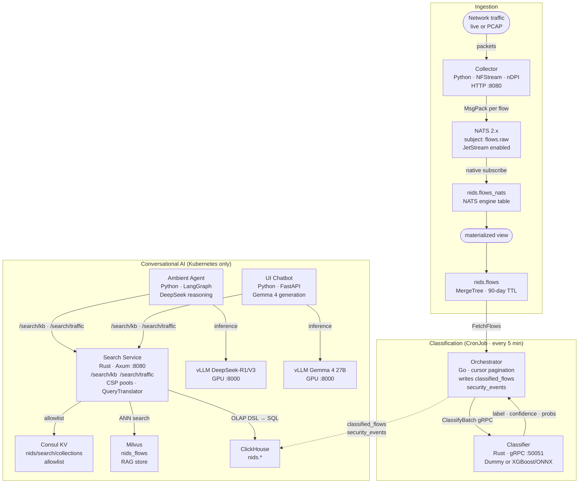

# Agentic NIDS — Architecture

## Overview

The system has three logical layers:

1. **Ingestion** — captures network traffic, assembles flows, stores them in ClickHouse.
2. **Classification** — a batch job reads flows, sends them to a gRPC classifier, writes augmented results back to ClickHouse.
3. **Conversational AI** — an ambient agent and a UI chatbot that reason over classified flows using LLMs and RAG.



---

## Components

### 1. NFStream Collector (`services/agent/collector.py`)

Captures packets from a **live interface** or a **PCAP file** and assembles them
into bidirectional network flows using NFStream / nDPI.

Each completed flow is serialised as **MsgPack** and published individually to
the NATS subject `flows.raw`.

A **FastAPI status server** runs concurrently on `--status-port` (default 8080):

| Endpoint | Description |
|----------|-------------|
| `GET /health` | Liveness check |
| `GET /state` | Full internal state (flows published, errors, uptime, etc.) |
| `GET /state/flows` | Last 20 published flow summaries |

**Flow fields**

| Category | Fields |
|----------|--------|
| Identification | `flow_id`, `src_ip`, `dst_ip`, `src_port`, `dst_port`, `protocol`, `ip_version` |
| Timing | `bidirectional_first/last_seen_ms`, `bidirectional_duration_ms` |
| Volume | packets and bytes, both directions |
| Application | `application_name`, `application_category_name` (nDPI L7), `requested_server_name` |
| Derived | `packets_per_second`, `bytes_per_second` |
| Statistical (optional) | min/mean/stddev/max of packet sizes and inter-arrival times |
| TCP flags | SYN, ACK, PSH, RST, FIN counts |

Statistical fields are enabled by default (`capture.statistical_analysis: true`)
and are required by the XGBoost classifier backend.

**Configuration** — `services/agent/config/config.yaml`

```yaml
nats:
  url: "nats://localhost:4222"
  subject: "flows.raw"

capture:
  interface: null        # live interface, e.g. eth0 (requires root)
  pcap_file: null        # offline PCAP
  statistical_analysis: true
  idle_timeout: 120      # seconds
  active_timeout: 1800

status:
  port: 8080
```

**CLI**

```bash
nids-collector --interface eth0
nids-collector --pcap traffic.pcap
nids-collector --list-interfaces
nids-collector --daemon --pid-file /var/run/nids.pid --log-file /var/log/nids.log
```

---

### 2. NATS (`nats:2.10-alpine`)

Lightweight pub/sub broker.

- Collector publishes to `flows.raw` (one message per flow, MsgPack payload).
- ClickHouse subscribes via its built-in NATS engine table.
- JetStream enabled (`-js`) for optional persistent replay.

| Port | Purpose |
|------|---------|
| 4222 | Client connections |
| 8222 | HTTP monitoring / healthz |

---

### 3. ClickHouse (`clickhouse/clickhouse-server:24.3`)

**No separate bridge process.** ClickHouse consumes from NATS directly using
its built-in `NATS` table engine. A materialized view pipes rows into the
persistent MergeTree table.

**Tables** — `services/agent/schema.sql`

| Table | Engine | TTL | Description |
|-------|--------|-----|-------------|
| `nids.flows_nats` | NATS | — | Live NATS consumer (MsgPack, `flows.raw`) |
| `nids.flows` | MergeTree | 90 days | All ingested flows (persistent) |
| `nids.classified_flows` | MergeTree | 30 days | Flows augmented with label + confidence |
| `nids.security_events` | MergeTree | — | Threat-only events (is_threat=1) |
| `nids.classifier_alarms` | MergeTree | 30 days | Raw classifier audit log (written by Rust service) |

**Materialized view**

```
flows_nats  ──(flows_mv)──▶  flows
```

**Ports**

| Port | Purpose |
|------|---------|
| 8123 | HTTP interface (used by ch-ui and clickhouse-connect) |
| 9000 | Native TCP interface (used by orchestrator) |

---

### 4. Orchestrator (`services/orchestrator/`, Go)

Runs as a **Kubernetes CronJob** (or ad-hoc via `make run-orchestrator`).
On each invocation it:

1. Loads a persisted cursor (timestamp) from `--state-dir`.
2. Connects to ClickHouse and paginates `nids.flows` from the cursor onwards.
3. For each page, calls `ClassifierService.ClassifyBatch` (gRPC).
4. Writes augmented rows to `nids.classified_flows` and threat rows to `nids.security_events`.
5. Advances and persists the cursor.

**Configuration** (CLI flags / env vars from ConfigMap)

| Flag | Env | Default | Description |
|------|-----|---------|-------------|
| `--ch-addr` | `NIDS_CH_ADDR` | `clickhouse.nids.svc.cluster.local:9000` | ClickHouse TCP |
| `--ch-db` | `NIDS_CH_DB` | `nids` | Database |
| `--classifier-addr` | `NIDS_CLASSIFIER_ADDR` | `classifier.nids.svc.cluster.local:50051` | gRPC endpoint |
| `--batch-size` | `NIDS_BATCH_SIZE` | `256` | Flows per gRPC call |
| `--limit` | `NIDS_LIMIT` | `1000` | Max flows per run |
| `--state-dir` | `NIDS_STATE_DIR` | `/state` | Cursor persistence directory |

---

### 5. Classifier (`services/classifier/`, Rust)

Long-running **gRPC server** implementing `ClassifierService.ClassifyBatch`.

Two interchangeable backends selected via `--classifier-type`:

**DummyClassifier** (default, no model needed)
- Deterministic pseudo-random labels and confidence scores based on `flow_id` hash.
- Useful for development and integration testing.

**XGBoostClassifier** (`--classifier-type xgboost`)
- ONNX model inference via OnnxRuntime (`ort` crate).
- Requires `cargo build --features xgboost` and `--model path/to/model.onnx`.
- Expects a `[N, 22]` float32 input matrix.
- CPU execution provider by default; CUDA supported via `NIDS_ORT_EP=cuda`.

**22-feature input vector** (XGBoost mode)

```
bidirectional_duration_ms  bidirectional_packets   bidirectional_bytes
src2dst_packets             dst2src_packets         src2dst_bytes
dst2src_bytes               packets_per_second      bytes_per_second
bidirectional_min_ps        bidirectional_mean_ps   bidirectional_stddev_ps
bidirectional_max_ps        bidirectional_min_piat_ms  bidirectional_mean_piat_ms
bidirectional_stddev_piat_ms  bidirectional_max_piat_ms
bidirectional_syn_packets   bidirectional_ack_packets  bidirectional_psh_packets
bidirectional_rst_packets   bidirectional_fin_packets
```

**Default labels:** `BENIGN, DoS, DDoS, PortScan, BruteForce, WebAttack, Botnet, Malware`
(configurable via `--labels` / `NIDS_CLASSIFIER_LABELS`).

---

### 6. Search Service (`services/search/`, Rust)

A Rust/Axum HTTP service that is the **single retrieval gateway** for all AI
components. Neither the ambient agent nor the chatbot talks to Milvus or
ClickHouse directly — every lookup goes through this service.

**Endpoints**

| Endpoint | Description |
|----------|-------------|
| `POST /search/kb` | ANN vector search on a named Milvus collection (RAG) |
| `POST /search/traffic` | OLAP query against ClickHouse (DSL → SQL, no raw SQL) |
| `GET /collections` | Live allowlist from Consul KV |
| `GET /health` | Liveness probe |

---

**Module structure**

| File | Role |
|------|------|
| `src/query.rs` | Database-agnostic OLAP DSL types (`TrafficRequest`, `Filter`, `Metric`, `Join`, `UnionClause`, …) + `QueryTranslator` trait |
| `src/backend.rs` | `SearchBackend<Req,Resp>` trait + `SearchRouter` (type-erased registration/dispatch) |
| `src/pool.rs` | `Pool<T>`: lock-free `AtomicUsize` round-robin, bounded `mpsc`, async backpressure via `.send()` |
| `src/consul.rs` | Consul KV watcher; refreshes `ArcSwap<HashSet<String>>` in the background |
| `src/clickhouse.rs` | `ClickHouseTranslator` (implements `QueryTranslator`) + `ClickHouseBackend` (CSP worker pool) |
| `src/milvus.rs` | `MilvusBackend` (CSP worker pool, Milvus REST v2) |
| `src/main.rs` | Args, startup, HTTP routes |

---

**CSP actor pools**

Each backend (ClickHouse, Milvus) owns a fixed pool of N Tokio tasks. Each
worker holds its own `reqwest::Client` — no sharing, no mutexes. A handler:

1. Creates an `oneshot` channel.
2. Sends `Cmd { payload, reply: tx }` via `pool.dispatch()` — lock-free
   round-robin using `AtomicUsize::fetch_add(Relaxed)`.
3. `await`s the oneshot receiver.

The pool's bounded `mpsc` channel provides natural backpressure (the handler
yields while all workers are at capacity). The only error path is worker exit
(channel closed → `PoolError::Shutdown`).

---

**Unified `SearchBackend` trait + `SearchRouter`**

```rust
trait SearchBackend {
    type Req: DeserializeOwned;
    type Resp: Serialize;
    fn search(&self, req: Req) -> impl Future<Output = anyhow::Result<Resp>> + Send;
}
```

`SearchRouter` erases each backend's types at registration time into a
`Value → BoxFuture<Value>` closure. Handlers call
`router.dispatch("kb" | "traffic", json_body)` and never reference backend
types directly. Adding a new backend is one `router.register(…)` call.

---

**QueryTranslator — translation layer**

`query.rs` defines the database-agnostic OLAP DSL and the trait:

```rust
trait QueryTranslator: Send + Sync {
    fn compile(&self, req: &TrafficRequest, limit: usize) -> anyhow::Result<String>;
    fn parse_response(&self, raw: Value, …) -> anyhow::Result<TrafficResponse>;
}
```

`ClickHouseTranslator` is the only implementation today. To target a different
database (DuckDB, PostgreSQL, …), implement `QueryTranslator` for it and pass
`Arc::new(MyTranslator)` to `ClickHouseBackend::new()` — no other code changes.

---

**Collection allowlist — Consul KV**

Stored at `nids/search/collections` (JSON array, e.g. `["nids_flows","nids.security_events"]`).
A background task polls Consul every `NIDS_CONSUL_POLL_S` seconds and atomically
swaps in the new set via `ArcSwap` — reads are lock-free. Requests whose
`collection` field is not in the allowlist are rejected with `403 Forbidden`.
Falls back to `NIDS_MILVUS_COLLECTIONS` at startup if Consul is unreachable.

---

**OLAP DSL — `/search/traffic`**

All identifiers are validated (`[a-zA-Z0-9_]` only) and backtick-quoted; string
values are single-quoted with `'` escaping. No raw SQL reaches the database.

*Fields:*

| Field | Type | Description |
|-------|------|-------------|
| `collection` | string | ClickHouse table (`schema.table`), from Consul allowlist |
| `dimensions` | string[] | Columns to SELECT and GROUP BY |
| `metrics` | Metric[] | Aggregations: `count`, `count_distinct`, `sum`, `avg`, `min`, `max` |
| `filters` | Filter[] | WHERE conditions (AND-combined) |
| `joins` | Join[] | JOIN to another OLAP cube (inner/left/right/full/cross) |
| `union_all` | UnionClause[] | Additional branches combined with UNION ALL |
| `order_by` | OrderBy[] | Applies after UNION ALL / JOIN |
| `limit` | int | Row cap (capped at `NIDS_SQL_ROW_LIMIT`) |

*Filter operators:* `eq` `ne` `gt` `gte` `lt` `lte` `in` `not_in` `like` `ilike` `is_null` `is_not_null`

The response includes `compiled_query` (the SQL sent to ClickHouse) for debugging.

*Example — JOIN two cubes:*

```json
{
  "collection": "nids.security_events",
  "dimensions": ["se.src_ip", "cf.label"],
  "metrics":    [{"agg": "count", "field": "*", "alias": "hits"}],
  "filters":    [{"field": "confidence", "op": "gte", "value": 0.9}],
  "joins": [{
    "collection": "nids.classified_flows",
    "alias":      "cf",
    "kind":       "inner",
    "on":         [{"left": "flow_id", "right": "flow_id"}]
  }],
  "order_by": [{"field": "hits", "dir": "desc"}],
  "limit": 50
}
```

*Example — UNION ALL across two labels:*

```json
{
  "collection": "nids.security_events",
  "dimensions": ["src_ip"],
  "metrics":    [{"agg": "count", "field": "*", "alias": "hits"}],
  "filters":    [{"field": "label", "op": "eq", "value": "DoS"}],
  "union_all": [{
    "dimensions": ["src_ip"],
    "metrics":    [{"agg": "count", "field": "*", "alias": "hits"}],
    "filters":    [{"field": "label", "op": "eq", "value": "DDoS"}]
  }],
  "order_by": [{"field": "hits", "dir": "desc"}],
  "limit": 100
}
```

*Example — ILIKE pattern:*

```json
{
  "collection": "nids.flows",
  "dimensions": ["src_ip", "application_name"],
  "filters":    [{"field": "application_name", "op": "ilike", "value": "%dns%"}],
  "limit": 200
}
```

---

**Configuration** (env vars from ConfigMap / Vault)

| Env | Default | Description |
|-----|---------|-------------|
| `NIDS_SEARCH_ADDR` | `0.0.0.0:8080` | HTTP listen address |
| `NIDS_CH_URL` | `http://localhost:8123` | ClickHouse HTTP URL |
| `NIDS_CH_DB` | `nids` | Database |
| `NIDS_CH_WORKERS` | `4` | ClickHouse worker pool size |
| `NIDS_SQL_ROW_LIMIT` | `1000` | Max rows per response |
| `NIDS_MILVUS_URI` | `http://localhost:19530` | Milvus REST endpoint |
| `NIDS_MIL_WORKERS` | `4` | Milvus worker pool size |
| `NIDS_VECTOR_TOP_K_LIMIT` | `100` | Hard cap on ANN top-k |
| `NIDS_CONSUL_URL` | `http://localhost:8500` | Consul agent URL |
| `NIDS_CONSUL_POLL_S` | `30` | Collection allowlist refresh interval (s) |
| `NIDS_MILVUS_COLLECTIONS` | `nids_flows` | Startup fallback if Consul unreachable |

---

### 8. Ambient Agent (`services/ai_agent/`, Python)

A **LangGraph**-orchestrated agent that runs continuously as a Kubernetes
Deployment. It acts as the "always-on" AI analyst of the NIDS.

**Responsibilities**

1. **Flow ingestion** — polls `nids.classified_flows` and `nids.security_events`
   for rows newer than its last checkpoint.
2. **Embedding** — converts each flow's structured fields into a natural-language
   summary, embeds it with a sentence-transformer model, and upserts the vector
   into **Milvus** (collection `nids_flows`).
3. **Threat analysis** — for each batch of new security events, runs a
   LangGraph reasoning chain backed by **DeepSeek-R1/V3** (served by its
   dedicated vLLM pod):
   - Retrieve similar historical events from Milvus (RAG).
   - Reason over the retrieved context + raw event fields.
   - Produce a structured incident summary (attack type, affected hosts,
     recommended response, confidence).
4. **Output** — summaries are written to `nids.ai_incidents` (ClickHouse) and
   optionally published to a NATS subject for downstream alerting.

**LangGraph graph**

```
[fetch_new_events] → [embed_and_store] → [rag_retrieve] → [llm_analyze] → [write_summary]
        ↑___________________________________|  (loop while events remain)
```

**Configuration** (env vars injected from ConfigMap / Vault)

| Env | Description |
|-----|-------------|
| `NIDS_CH_URL` | ClickHouse HTTP URL |
| `NIDS_MILVUS_URI` | Milvus gRPC URI (e.g. `http://milvus.nids:19530`) |
| `NIDS_DEEPSEEK_URL` | vLLM endpoint serving DeepSeek (e.g. `http://vllm-deepseek:8000/v1`) |
| `NIDS_DEEPSEEK_MODEL` | Model name (e.g. `deepseek-ai/DeepSeek-R1-Distill-Llama-8B`) |
| `NIDS_POLL_INTERVAL_S` | Seconds between ClickHouse polls (default `30`) |
| `NIDS_EMBED_MODEL` | Sentence-transformer model for embeddings (default `all-MiniLM-L6-v2`) |

---

### 9. vLLM — DeepSeek (`infra/k8s/vllm-deepseek-deployment.yaml`)

Dedicated **vLLM** server instance serving the DeepSeek reasoning model.

- **Model**: `deepseek-ai/DeepSeek-R1-Distill-Llama-8B` (or larger variant)
- **API**: OpenAI-compatible REST (`/v1/chat/completions`)
- **Port**: 8000
- **Node affinity**: GPU node pool

Used exclusively by the ambient agent for multi-step threat analysis.

---

### 10. vLLM — Gemma 4 (`infra/k8s/vllm-gemma4-deployment.yaml`)

Dedicated **vLLM** server instance serving the Gemma 4 conversational model.

- **Model**: `google/gemma-4-27b-it` (instruction-tuned)
- **API**: OpenAI-compatible REST (`/v1/chat/completions`)
- **Port**: 8000
- **Node affinity**: GPU node pool

Used by the UI chatbot for natural-language Q&A.

---

### 11. Milvus (vector database)

**Milvus** stores float32 embeddings of flow summaries and security events,
enabling semantic retrieval for RAG.

- **Collection**: `nids_flows`
  - `id` (INT64, primary)
  - `flow_id` (VARCHAR)
  - `embedding` (FLOAT_VECTOR, dim=384 for all-MiniLM-L6-v2)
  - `metadata` (JSON — label, confidence, src/dst IP, timestamp)
- Both the ambient agent (writes) and the UI chatbot (reads) share the collection.
- Deployed as a Kubernetes StatefulSet with MinIO for object storage.

---

### 12. UI Chatbot (`services/chatbot/`)

A web application that lets security analysts ask natural-language questions
about NIDS data.

**Request flow for a user question**

1. User submits a question (e.g. "What DoS attacks targeted 10.0.0.5 today?").
2. Chatbot embeds the question and queries **Milvus** for the top-k similar flow
   events.
3. Retrieved context + original question are sent to **Gemma 4** via vLLM.
4. For structured data (counts, time ranges), the chatbot also issues a
   ClickHouse SQL query and merges results.
5. Answer is streamed back to the user.

---

### 13. ch-ui

Web-based ClickHouse dashboard. Open **http://localhost:5521**.

Connect with URL `http://clickhouse:8123`, user `default`, password empty.

---

## gRPC API

**Proto**: `proto/classifier.proto`  
**Package**: `nids.classifier.v1`

```protobuf
service ClassifierService {
  rpc ClassifyBatch(ClassifyBatchRequest) returns (ClassifyBatchResponse);
}

message FlowFeatures { /* 28 fields: IPs, ports, protocol, stats, TCP flags */ }
message ClassifyResponse { string flow_id; string label; float confidence; repeated float probabilities; }
```

Regenerate Go stubs with `make proto`.

---

## Deployment

### Local (Docker Compose)

```bash
# PCAP mode
PCAP_FILE=/path/to/traffic.pcap docker compose up

# Live capture (uncomment cap_add in docker-compose.yml)
CAPTURE_IFACE=eth0 docker compose up
```

Note: vLLM, Milvus, and the ambient agent are Kubernetes-only components.

### Kubernetes (Kustomize)

```bash
kubectl apply -k infra/k8s/
```

Key manifests in `infra/k8s/`:
- `nats-deployment.yaml`
- `clickhouse-statefulset.yaml`
- `nids-collector-deployment.yaml`
- `classifier-deployment.yaml` + HPA
- `orchestrator-cronjob.yaml`
- `search-deployment.yaml` — Rust search gateway (Milvus + ClickHouse)
- `vllm-deepseek-deployment.yaml` — DeepSeek vLLM server
- `vllm-gemma4-deployment.yaml` — Gemma 4 vLLM server
- `milvus-statefulset.yaml` — Milvus + MinIO
- `ai-agent-deployment.yaml` — ambient LangGraph agent
- `chatbot-deployment.yaml` — UI chatbot
- `vault/` — HashiCorp Vault agent injection for secrets

### Terraform (Linode LKE)

Provision the Linode Kubernetes Engine cluster before applying manifests:

```bash
cd infra/terraform
cp terraform.tfvars.example terraform.tfvars
# edit terraform.tfvars with your Linode API token and preferences
terraform init
terraform plan
terraform apply
# Retrieve kubeconfig
terraform output -raw kubeconfig | base64 -d > ~/.kube/nids-linode.yaml
export KUBECONFIG=~/.kube/nids-linode.yaml
# Then deploy the stack
kubectl apply -k ../../infra/k8s/
```

See `infra/terraform/` for variables (GPU pool toggle, node types, regions).

### Helm

```bash
helm install agentic-nids infra/helm/agentic-nids \
  --namespace nids --create-namespace
```

### Observability

```bash
make obs-install   # Grafana + Promtail
```

---

## Scaling

| Concern | Solution |
|---------|---------|
| Higher ingest throughput | Multiple collector instances on different interfaces/hosts |
| More classification throughput | Scale classifier Deployment (HPA configured) |
| LLM inference latency | Increase GPU replicas for vLLM pods; use tensor parallelism |
| RAG recall quality | Increase Milvus top-k; tune embedding model |
| Long-term storage | Increase TTL in `nids.flows` or add ClickHouse tiered storage |
| ClickHouse HA | ClickHouse Keeper + replicated tables |

---

## Repository Layout

```
proto/
  classifier.proto              gRPC service definition

services/
  agent/                        NFStream collector (Python)
    collector.py
    schema.sql
    config/config.yaml
    pyproject.toml
    Dockerfile

  classifier/                   gRPC classifier (Rust)
    src/main.rs
    Cargo.toml
    Dockerfile

  orchestrator/                 Batch orchestrator (Go)
    cmd/main.go
    cmd/augment.go
    internal/ch/client.go
    internal/grpcclient/client.go
    internal/state/state.go
    gen/classifierv1/           Generated proto stubs
    Dockerfile

  search/                       Unified search gateway (Rust/Axum)
    src/query.rs                OLAP DSL types + QueryTranslator trait (DB-agnostic)
    src/backend.rs              SearchBackend trait + SearchRouter (type-erased dispatch)
    src/pool.rs                 CSP actor pool (AtomicUsize round-robin, mpsc + oneshot)
    src/consul.rs               Consul KV watcher + ArcSwap allowlist
    src/clickhouse.rs           ClickHouseTranslator + ClickHouseBackend (worker pool)
    src/milvus.rs               MilvusBackend (worker pool, Milvus REST v2)
    src/main.rs                 HTTP routes + startup
    Cargo.toml
    Dockerfile

  ai_agent/                     Ambient LangGraph agent (Python)
    agent.py                    LangGraph graph definition
    embedder.py                 Sentence-transformer embeddings
    ch_poller.py                ClickHouse polling + cursor management
    config/config.yaml
    pyproject.toml
    Dockerfile

  chatbot/                      UI chatbot (Python/FastAPI + frontend)
    app.py                      FastAPI + SSE streaming
    rag.py                      Search Service client
    Dockerfile

infra/
  k8s/                          Kubernetes manifests (Kustomize)
  helm/
    agentic-nids/               Main Helm chart
    observability/              Grafana + Promtail
  terraform/                    Linode LKE cluster provisioning
    main.tf                     LKE cluster + node pools + Helm/K8s
    variables.tf
    outputs.tf
    versions.tf
    terraform.tfvars.example

data/                           PCAP files for testing
honeypot/                       Attacker/victim container environment
docker-compose.yml              Local development stack (ingestion + classification only)
Makefile
```

---

*Last updated: 2026-05-31*
