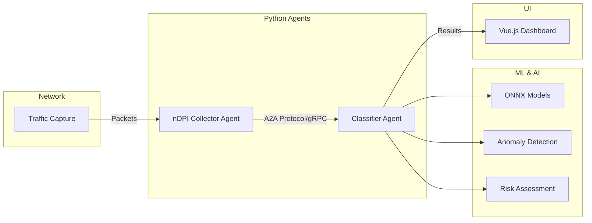

# Agentic Network Intrusion Detection System (NIDS)

**AI-Powered Network Security with Explainable Machine Learning**

A modern, Python-based Network Intrusion Detection System using Google's Agent2Agent (A2A) Protocol, ONNX ML models, and explainable AI for real-time threat detection and analysis.

## 🌟 Features

- **🤖 Agent2Agent Protocol** - Google's A2A protocol with gRPC streaming
- **🧠 ML-Powered Detection** - ONNX models for attack classification
- **📊 Real-time Dashboard** - Vue.js security monitoring UI
- **🔍 Explainable AI** - Feature importance and human-readable explanations
- **⚙️ Configurable** - YAML-based configuration (3-minute collection intervals)
- **☸️ Kubernetes Ready** - Production-grade Helm charts
- **🔄 Auto-scaling** - HPA for classifier and UI components

## 🏗️ Architecture



## 📋 Prerequisites

- **Python 3.11+** - For ML/AI agents
- **uv** - Python package manager (or pip)
- **Docker** - For containerization (optional)
- **Kubernetes** - For production deployment (optional)
- **Node.js 18+** - For UI development (optional)

## 🚀 Quick Start

### 1. Install Dependencies

```bash
cd agent
uv pip install -e ".[all]"

# Or with pip
pip install -e ".[all]"
```

### 2. Run Quick Test

```bash
# Test with synthetic data
python main.py --mode test
```

### 3. Analyze PCAP File

```bash
# Process a PCAP file
python main.py --mode pcap --pcap /path/to/traffic.pcap --interval 60
```

### 4. Live Capture

```bash
# Capture live traffic (requires sudo)
sudo python main.py --mode live --interface eth0 --interval 180
```

## 📊 System Components

### 1. **Classifier Agent** (A2A Server)

Receives flows and performs ML-based classification:

```bash
# Run standalone classifier
python main.py --mode classifier --port 50051
```

**Features:**
- ONNX model inference
- Attack type detection (DoS, DDoS, port scan, malware, etc.)
- Anomaly detection
- Risk scoring (0-1 scale)
- Explainable AI with feature importance

### 2. **nDPI Collector Agent** (A2A Client)

Collects network flows and sends to classifier:

```bash
# Run standalone collector
python main.py --mode collector --config config/ndpi_agent.yaml
```

**Features:**
- Packet capture (live/PCAP)
- Flow aggregation (configurable interval)
- nDPI protocol detection
- Batch processing
- Alert management

### 3. **Security Dashboard** (Vue.js UI)

Real-time threat visualization:

```bash
cd agent/ui
npm install
npm run dev
```

**Features:**
- Real-time threat alerts
- Risk level visualization
- Threat details and explanations
- Recommended actions
- Filter by risk level

## ⚙️ Configuration

### YAML Configuration

Edit `agent/config/ndpi_agent.yaml`:

```yaml
# Collection interval (seconds)
collection_interval: 180  # 3 minutes

# Classifier connection
classifier_agent_url: "grpc://localhost:50051"

# Alert settings
alert_threshold: 0.7  # Risk score 0-1
auto_block: false     # Enable auto-blocking

# Processing
batch_size: 100
max_concurrent_requests: 10
```

### Pre-configured Templates

- **`config/ndpi_agent.yaml`** - Default configuration
- **`config/ndpi_agent_live.yaml`** - Live capture optimized
- **`config/ndpi_agent_pcap.yaml`** - PCAP analysis optimized

## 🐳 Docker Deployment

Build Docker images:

```bash
# Classifier
docker build -t jozoppi/classifier:1.0 -f docker/Dockerfile.classifier .

# Collector
docker build -t jozoppi/ndpi-collector:1.0 -f docker/Dockerfile.collector .

# UI
docker build -t jozoppi/nids-ui:1.0 -f docker/Dockerfile.ui ./agent/ui
```

## ☸️ Kubernetes Deployment

Deploy to Kubernetes cluster:

```bash
cd infra/helm

# Install Helm chart
helm install agentic-nids ./agentic-nids \
  --namespace nids \
  --create-namespace

# Access UI
kubectl get svc agentic-nids-ui -n nids
```

**Services Exposed:**
- **UI**: LoadBalancer on port 80 (accessible externally)
- **Classifier**: ClusterIP on port 50051 (internal gRPC)
- **Collector**: ClusterIP on port 8000 (internal)

See [infra/README.md](infra/README.md) for detailed deployment guide.

## 📖 Documentation

- **[Agent README](agent/README.md)** - Classifier agent details
- **[nDPI Integration](agent/NDPI_INTEGRATION.md)** - Collector agent guide
- **[Kubernetes Deployment](infra/README.md)** - Infrastructure guide

## 🧪 Testing

### Test Modes

```bash
# Quick synthetic test
python main.py --mode test

# PCAP analysis
python main.py --mode pcap --pcap data/sample.pcap

# Live capture
sudo python main.py --mode live --interface eth0
```

## 🎯 Use Cases

1. **Network Monitoring** - Real-time threat detection
2. **PCAP Analysis** - Offline traffic analysis
3. **Security Research** - ML model evaluation
4. **Incident Response** - Threat investigation
5. **Compliance** - Security audit trails

## 📊 Attack Types Detected

- **DoS/DDoS** - Denial of Service attacks
- **Port Scan** - Network reconnaissance
- **Brute Force** - Authentication attacks
- **Malware** - C&C communication
- **Botnet** - Coordinated attacks
- **SQL Injection** - Database attacks
- **XSS** - Cross-site scripting
- **Probe** - Network mapping

## 🔬 ML Models

The system uses ONNX format for ML models:

- **Primary Model**: Flow classifier (XGBoost/Random Forest)
- **Anomaly Detection**: Isolation Forest
- **Risk Assessment**: Ensemble scoring

### Training Custom Models

See `agent/README.md` for model training guide.

## 🔧 Development

### Project Structure

```
agentic-nids/
├── agent/                      # Python agents
│   ├── classifier_agent_a2a.py # Classifier (A2A server)
│   ├── ndpi_collector_agent.py # Collector (A2A client)
│   ├── main.py                 # Main entry point
│   ├── config/                 # YAML configurations
│   ├── ui/                     # Vue.js dashboard
│   └── pyproject.toml          # Python dependencies
├── infra/                      # Kubernetes infrastructure
│   └── helm/                   # Helm charts
│       └── agentic-nids/
├── nDPI/                       # nDPI library (submodule)
└── README.md                   # This file
```

### Contributing

1. Fork the repository
2. Create feature branch (`git checkout -b feature/amazing-feature`)
3. Commit changes (`git commit -m 'Add amazing feature'`)
4. Push to branch (`git push origin feature/amazing-feature`)
5. Open Pull Request

## 🔐 Security

- Network policies enabled by default
- Pod security contexts
- Read-only root filesystem
- Non-root user execution
- TLS/HTTPS support

## 📚 References

**Research Papers:**
- [Large Language Models for Network Intrusion Detection](https://arxiv.org/html/2507.04752v1)
- [Explainable Network Intrusion Detection using LLMs](https://arxiv.org/html/2408.04342v1)
- [ChatIDS: Explainable Cybersecurity](https://arxiv.org/abs/2306.14504)

**Technologies:**
- [Google A2A Protocol](https://a2a-protocol.org/)
- [ONNX Runtime](https://onnxruntime.ai/)
- [nDPI - Deep Packet Inspection](https://www.ntop.org/products/deep-packet-inspection/ndpi/)
- [Vue.js](https://vuejs.org/)

## 📝 License

MIT License - See [LICENSE](LICENSE) file for details

## 👥 Authors

**Agentic NIDS Team**

## 🙏 Acknowledgments

- nDPI team for deep packet inspection library
- Google for A2A Protocol
- ONNX Runtime team
- Open source ML/security community

## 📞 Support

- **Issues**: [GitHub Issues](https://github.com/your-org/agentic-nids/issues)
- **Discussions**: [GitHub Discussions](https://github.com/your-org/agentic-nids/discussions)
- **Documentation**: [Full Docs](https://docs.example.com/agentic-nids)

---

**Built with ❤️ for Network Security**
