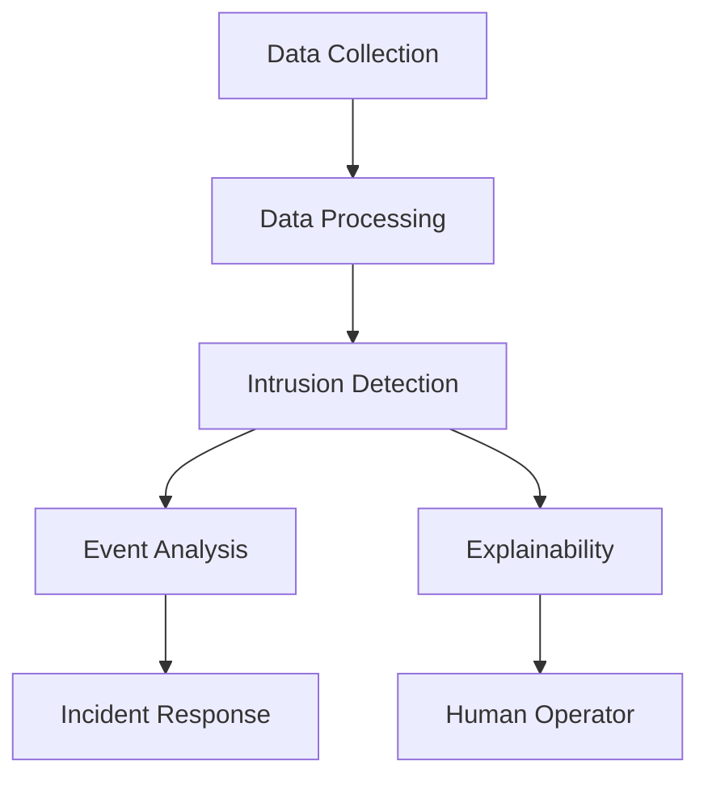
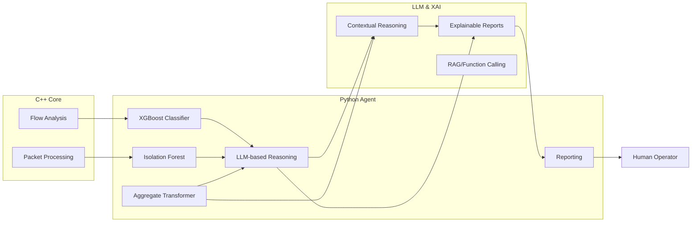
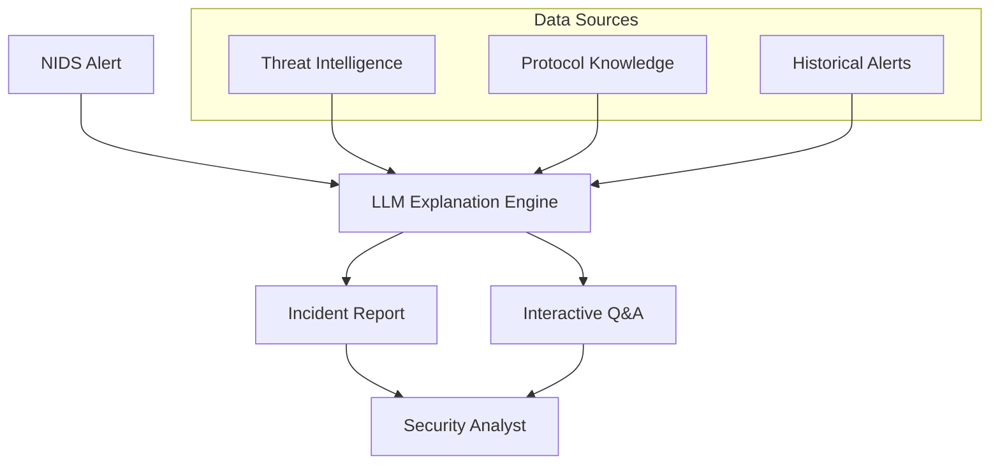

# agentic-nids

Agentic Network Intrusion Detection System (NIDS)

## Compilation & Setup

### Prerequisites
- **Bazel** - Build system for C++ components on Debian/Ubuntu: ```sudo apt install bazel-bootstrap```
- **Git** - For submodule management (nDPI dependency)
- **Python 3.8+** - For the ML/LLM agent
- **uv** - Python package manager
- **clang/g++** - C++ compilers
- **vcpkg** - C++ dependency manager (optional)

### Quick Start
```bash
# Clone the repository with submodules
git clone --recursive https://github.com/your-org/agentic-nids.git
cd agentic-nids

# Build everything (dependencies + C++ + Python)
make -f Makefile.build
```

### Build Commands

#### Full Build (Recommended)
```bash
make -f Makefile.build
```
This command will:
1. Initialize and update the nDPI submodule
2. Build all C++ components with Bazel
3. Run linting and formatting checks

#### Individual Build Steps
```bash
# Initialize dependencies (nDPI submodule)
make -f Makefile.build deps

# Build C++ components only
make -f Makefile.build bazel-build

# Run linting
make -f Makefile.build lint

# Run formatting
make -f Makefile.build format
```

#### Python Agent Setup
```bash
cd agent
uv pip install -r requirements.txt
uv pip install .
```

### Dependencies
The project uses **nDPI** (Network Deep Packet Inspection) library as a git submodule for advanced protocol detection and flow analysis. The build system automatically manages this dependency.

## Design & Architecture

### Cognitive & Explainable NIDS: Concepts & Pipeline
This project is inspired by recent advances in Cognitive and Explainable Network Intrusion Detection Systems (NIDS), as described in:
- [Large Language Models for Network Intrusion Detection Systems: Foundations, Implementations, and Future Directions](https://arxiv.org/html/2507.04752v1)
- [Towards Explainable Network Intrusion Detection using Large Language Models](https://arxiv.org/html/2408.04342v1)
- [ChatIDS: Explainable Cybersecurity Using Generative AI](https://arxiv.org/abs/2306.14504)

Cognitive NIDS go beyond traditional and intelligent NIDS by integrating Large Language Models (LLMs) for contextual reasoning, explainable decision-making, and automated response. Explainable NIDS leverage LLMs and XAI techniques (e.g., SHAP, feature importance) to provide human-understandable justifications for alerts and decisions. The ChatIDS-inspired module further enhances the system by generating context-aware, human-readable incident reports and supporting interactive Q&A for security analysts.

#### Key Pipeline Stages



#### Architecture Overview


#### LLM-Powered Explanation Module


#### Cognitive & Explainable Features
- **LLM Integration:** Contextual reasoning, multimodal data analysis, and natural language reporting.
- **Explainability:** Human-readable incident reports, SHAP/XAI feature importance, and justifications for detection decisions.
- **Automation:** Automated event correlation, response workflows, and function calling for threat mitigation.
- **LLM-Powered Explanations:** Automated incident reports, retrieval-augmented generation (RAG), interactive Q&A, and prompt engineering for tailored explanations.


#### ML Models
- **XGBoost Classifier:** Supervised attack classification.
- **Isolation Forest:** Unsupervised anomaly detection.
- **Aggregate Transformer (FlowTransformer):** Aggregates and models network flows using transformer architectures for advanced anomaly and attack detection.
- **LLM-based Reasoning:** For explanations and contextual analysis.

#### Build System
- **Bazel:** Builds and manages C++ targets and nDPI integration
- **Git Submodules:** Manages nDPI dependency automatically
- **Make:** Orchestrates the build process with dependency management
- **uv:** Manages Python dependencies

#### Development Environment
- **Devcontainer:** Pre-configured for C++, Python, Bazel, vcpkg, and uv.

#### Extensibility
- Add new Python agents for rapid prototyping.
- Extend C++ modules for performance-critical tasks.
- Integrate additional ML/LLM models for advanced detection and reasoning.

## Repository Structure
```
agentic-nids/
├── src/              # C++ source files (flow analysis, packet processing)
├── include/          # C++ header files
├── agent/            # Python ML/LLM agent package
├── nDPI/             # nDPI library (git submodule)
├── .devcontainer/    # Development container configuration
├── .github/          # CI/CD workflows and configurations
├── Makefile.build    # Unified build, lint, and format commands
├── WORKSPACE         # Bazel workspace configuration
├── BUILD             # Main Bazel build configuration
└── README.md         # This file
```

### Key Components
- **C++ Core (`src/`, `include/`):** High-performance packet processing and flow analysis using nDPI
- **Python Agent (`agent/`):** ML models, LLM integration, and explainable AI components
- **nDPI Integration:** Advanced protocol detection and deep packet inspection capabilities
- **Build System:** Automated dependency management and cross-language builds
