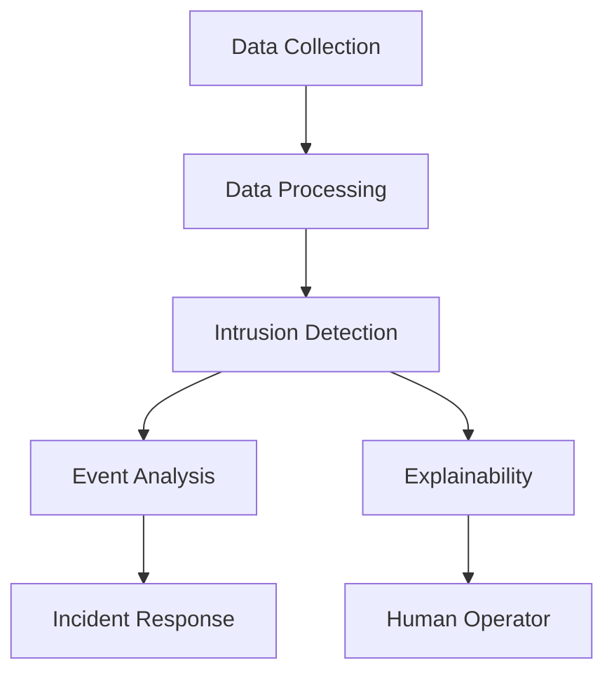
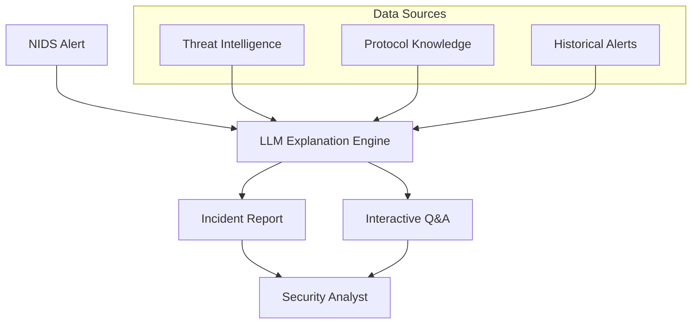

# agentic-nids

Agentic Network Intrusion Detection System (NIDS)

## Compilation & Setup

### Prerequisites
- Bazel (build system)
- vcpkg (C++ dependency manager)
- Python 3.8+
- uv (Python package manager)
- clang/g++ (C++ compilers)

### Build All (C++ & Python)
```bash
make -f Makefile.build
```

### Build C++ Only (Bazel)
```bash
make -f Makefile.build bazel-build
```

### Lint & Format
```bash
make -f Makefile.build lint
make -f Makefile.build format
```

### Python Package
```bash
cd agent
uv pip install -r requirements.txt
uv pip install .
```

## Design & Architecture

### Cognitive & Explainable NIDS: Concepts & Pipeline
This project is inspired by recent advances in Cognitive and Explainable Network Intrusion Detection Systems (NIDS), as described in:
- [Large Language Models for Network Intrusion Detection Systems: Foundations, Implementations, and Future Directions](https://arxiv.org/html/2507.04752v1)
- [Towards Explainable Network Intrusion Detection using Large Language Models](https://arxiv.org/html/2408.04342v1)
- [ChatIDS: Explainable Cybersecurity Using Generative AI](https://arxiv.org/abs/2306.14504)

Cognitive NIDS go beyond traditional and intelligent NIDS by integrating Large Language Models (LLMs) for contextual reasoning, explainable decision-making, and automated response. Explainable NIDS leverage LLMs and XAI techniques (e.g., SHAP, feature importance) to provide human-understandable justifications for alerts and decisions. The ChatIDS-inspired module further enhances the system by generating context-aware, human-readable incident reports and supporting interactive Q&A for security analysts.

#### Key Pipeline Stages



#### Architecture Overview
```mermaid
flowchart LR
	subgraph C++ Core
		CC1[Flow Analysis]
		CC2[Packet Processing]
	end
	subgraph Python Agent
		PA1[XGBoost Classifier]
		PA2[Isolation Forest]
		PA3[LLM-based Reasoning]
		PA4[Reporting]
		PA5[Aggregate Transformer (FlowTransformer)]
	end
	subgraph LLM & XAI
		LX1[Contextual Reasoning]
		LX2[Explainable Reports]
		LX3[RAG/Function Calling]
	end
	CC1 --> PA1
	CC2 --> PA2
	PA1 --> PA3
	PA2 --> PA3
	PA3 --> LX1
	PA3 --> LX2
	PA5 --> PA3
	PA5 --> LX1
	LX1 --> LX2
	LX2 --> PA4
	PA4 --> Human[Human Operator]
```

#### LLM-Powered Explanation Module (ChatIDS-inspired)


#### Cognitive & Explainable Features
- **LLM Integration:** Contextual reasoning, multimodal data analysis, and natural language reporting.
- **Explainability:** Human-readable incident reports, SHAP/XAI feature importance, and justifications for detection decisions.
- **Automation:** Automated event correlation, response workflows, and function calling for threat mitigation.
- **LLM-Powered Explanations:** Automated incident reports, retrieval-augmented generation (RAG), interactive Q&A, and prompt engineering for tailored explanations.


#### ML Models
- **XGBoost Classifier:** Supervised attack classification.
- **Isolation Forest:** Unsupervised anomaly detection.
- **Aggregate Transformer (FlowTransformer):** Aggregates and models network flows using transformer architectures for advanced anomaly and attack detection.
- **LLM-based Reasoning:** For explanations and contextual analysis.

#### Build System
- **Bazel:** Builds and manages C++ targets.
- **vcpkg:** Handles C++ dependencies.
- **uv:** Manages Python dependencies.

#### Development Environment
- **Devcontainer:** Pre-configured for C++, Python, Bazel, vcpkg, and uv.

#### Extensibility
- Add new Python agents for rapid prototyping.
- Extend C++ modules for performance-critical tasks.
- Integrate additional ML/LLM models for advanced detection and reasoning.

## Repository Structure
- `src/` - C++ source files
- `include/` - C++ headers
- `agent/` - Python agent package
- `.devcontainer/` - Devcontainer config and vcpkg dependencies
- `.github/workflows/` - CI workflows
- `Makefile.build` - Unified build, lint, and format commands
- `WORKSPACE`, `BUILD` - Bazel build files
