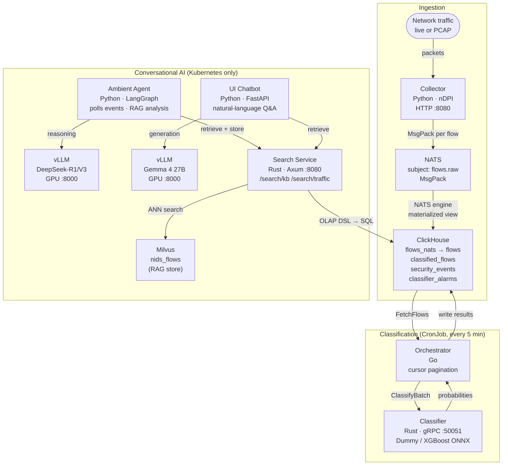

# Agentic NIDS

**AI-Powered Network Intrusion Detection System**

A production-grade, cloud-native NIDS built on three microservices — a Python network-flow collector, a Rust ML classifier, and a Go orchestrator — connected via NATS and ClickHouse.

## Architecture


```mermaid
flowchart TB
    subgraph Ingestion
        Traffic([Network traffic
live or PCAP])
        Collector["Collector
Python · nDPI
HTTP :8080"]
        NATS["NATS
subject: flows.raw
MsgPack"]
        CH["ClickHouse
flows_nats → flows
classified_flows
security_events
classifier_alarms"]

        Traffic -->|packets| Collector
        Collector -->|MsgPack per flow| NATS
        NATS -->|NATS engine
materialized view| CH
    end

    subgraph Classification ["Classification  (CronJob, every 5 min)"]
        Orch["Orchestrator
Go
cursor pagination"]
        Clf["Classifier
Rust · gRPC :50051
Dummy / XGBoost ONNX"]

        CH -->|FetchFlows| Orch
        Orch -->|ClassifyBatch| Clf
        Clf -->|probabilities| Orch
        Orch -->|write results| CH
    end

    subgraph ConvAI ["Conversational AI  (Kubernetes only)"]
        Agent["Ambient Agent
Python · LangGraph
polls events · RAG analysis"]
        Chatbot["UI Chatbot
Python · FastAPI
natural-language Q&A"]
        vLLM_DS["vLLM
DeepSeek-R1/V3
GPU :8000"]
        vLLM_G4["vLLM
Gemma 4 27B
GPU :8000"]
        Search["Search Service
Rust · Axum :8080
/search/kb  /search/traffic"]
        Milvus["Milvus
nids_flows
(RAG store)"]

        Agent -->|reasoning| vLLM_DS
        Chatbot -->|generation| vLLM_G4
        Agent -->|retrieve + store| Search
        Chatbot -->|retrieve| Search
        Search -->|ANN search| Milvus
        Search -->|OLAP DSL → SQL| CH
    end
```

ClickHouse consumes from NATS directly using its built-in **NATS table engine** — no separate bridge process is needed. The Conversational AI layer (vLLM, Milvus, agent, chatbot) is Kubernetes-only and not included in the local Docker Compose stack.

## Services

| Service | Language | Role |
|---------|----------|------|
| `services/agent` | Python 3.12 | NFStream/nDPI collector; publishes flows to NATS as MsgPack |
| `services/classifier` | Rust | gRPC server; DummyClassifier or XGBoost/ONNX backend |
| `services/orchestrator` | Go | CronJob; reads ClickHouse, batches flows to classifier, writes results |
| `services/ai_agent` | Python 3.12 | LangGraph ambient agent; RAG analysis of security events via DeepSeek |
| `services/chatbot` | Python 3.12 | FastAPI chatbot; natural-language Q&A over security data via Gemma 4 |
| `services/search` | Rust | Search gateway: `POST /search/kb` (Milvus RAG), `POST /search/traffic` (ClickHouse SQL) |

## Quick Start

**Prerequisites:** Docker, Docker Compose

### Offline (PCAP file)

```bash
PCAP_FILE=/path/to/traffic.pcap docker compose up
```

### Live capture (requires root / NET_RAW)

```bash
CAPTURE_IFACE=eth0 docker compose up
# Uncomment cap_add and network_mode in docker-compose.yml first
```

Services started:

| Service | URL |
|---------|-----|
| NATS broker | `nats://localhost:4222` |
| NATS monitoring | http://localhost:8222 |
| ClickHouse HTTP | http://localhost:8123 |
| ch-ui dashboard | http://localhost:5521 |
| Collector state API | http://localhost:8080/state |

Connect ch-ui to `http://clickhouse:8123`, user `default`, password empty.

## Build

```bash
# Generate proto stubs (required before building orchestrator/classifier)
make proto

# Build all services
make build

# Run services locally
make run-classifier     # Rust gRPC server on :50051
make run-orchestrator   # Go batch processor (one run)

# Tests
make test               # all services
make test-e2e           # orchestrator ↔ classifier gRPC end-to-end

# Docker images
make docker-build
```

See `make help` for all targets.

## Configuration

### Collector (`services/agent/config/config.yaml`)

```yaml
nats:
  url: "nats://localhost:4222"
  subject: "flows.raw"

capture:
  interface: null       # live interface (e.g. eth0), requires root
  pcap_file: null       # offline PCAP path
  statistical_analysis: true   # packet size + IAT stats (required by classifier)
  idle_timeout: 120
  active_timeout: 1800

status:
  port: 8080            # HTTP state API
```

CLI flags override config values:

```bash
nids-collector --interface eth0 --nats-url nats://localhost:4222
nids-collector --pcap traffic.pcap
nids-collector --daemon --pid-file /var/run/nids.pid
nids-collector --list-interfaces
```

### Classifier

| Flag / Env | Default | Description |
|------------|---------|-------------|
| `--addr` | `0.0.0.0:50051` | gRPC listen address |
| `--classifier-type` / `NIDS_CLASSIFIER_TYPE` | `dummy` | `dummy` or `xgboost` |
| `--model` / `NIDS_MODEL_PATH` | — | Path to `.onnx` model (xgboost mode) |
| `--labels` / `NIDS_CLASSIFIER_LABELS` | `BENIGN,DoS,DDoS,PortScan,BruteForce,WebAttack,Botnet,Malware` | Comma-separated class names |
| `--ch-url` / `NIDS_CH_URL` | — | ClickHouse HTTP URL (enables `classifier_alarms` writes) |

### Orchestrator

| Flag / Env | Default | Description |
|------------|---------|-------------|
| `--ch-addr` / `NIDS_CH_ADDR` | `clickhouse.nids.svc.cluster.local:9000` | ClickHouse TCP address |
| `--classifier-addr` / `NIDS_CLASSIFIER_ADDR` | `classifier.nids.svc.cluster.local:50051` | Classifier gRPC address |
| `--batch-size` / `NIDS_BATCH_SIZE` | `256` | Flows per gRPC call |
| `--limit` / `NIDS_LIMIT` | `1000` | Max flows per orchestrator run |
| `--state-dir` / `NIDS_STATE_DIR` | `/state` | Directory for cursor persistence |

## Deployment

### Kubernetes (Kustomize)

```bash
kubectl apply -k infra/k8s/
```

### Kubernetes (Helm)

```bash
helm install agentic-nids infra/helm/agentic-nids \
  --namespace nids \
  --create-namespace
```

### Observability (Grafana + Promtail)

```bash
make obs-install
```

See [ARCHITECTURE.md](ARCHITECTURE.md) for the full component reference and [infra/k8s/](infra/k8s/) for Kubernetes manifests.

## ClickHouse Tables

| Table | Content | TTL |
|-------|---------|-----|
| `nids.flows` | All collected network flows | 90 days |
| `nids.classified_flows` | Flows augmented with classifier output (BENIGN + threats) | 30 days |
| `nids.security_events` | Threat-only events for alerting | — |
| `nids.classifier_alarms` | Raw per-flow audit log from the classifier | 30 days |

## gRPC API

Proto definition: `proto/classifier.proto`

```protobuf
service ClassifierService {
  rpc ClassifyBatch(ClassifyBatchRequest) returns (ClassifyBatchResponse);
}
```

Input: 28-field `FlowFeatures` (IPs, ports, protocol, packet/byte counts, timing stats, TCP flags).
Output: `ClassifyResponse` with `label`, `confidence`, and per-class `probabilities`.

## ONNX / XGBoost Backend

Build the classifier with the `xgboost` feature to enable ONNX inference:

```bash
cargo build --release --features xgboost
```

Requires an ONNX model accepting a `[N, 22]` float32 input matrix (the 22 statistical features listed in `ARCHITECTURE.md`). Point to it with `--model path/to/model.onnx`.

## CI/CD

GitHub Actions (`.github/workflows/`):

- **CI** — path-filtered jobs per service: lint, test, Docker build. E2E gRPC test when orchestrator or classifier changes.
- **CD** — builds and pushes images to GHCR on every `main` push; deploys to Linode LKE on tags matching `*+k8s`.

## Attack Classes Detected

`BENIGN` · `DoS` · `DDoS` · `PortScan` · `BruteForce` · `WebAttack` · `Botnet` · `Malware`

Labels are configurable via `NIDS_CLASSIFIER_LABELS`.

## Test Data

Pre-recorded PCAP files in `data/`:
`java_rmi`, `hydra_ftp`, `0day`, `smtp`, `mirai`, `zeus`, `blackEnergy`, `normal`, `normal2`, and more.

Honeypot environment with attacker/victim containers: `honeypot/`.

## License

MIT — see [LICENSE](LICENSE).
