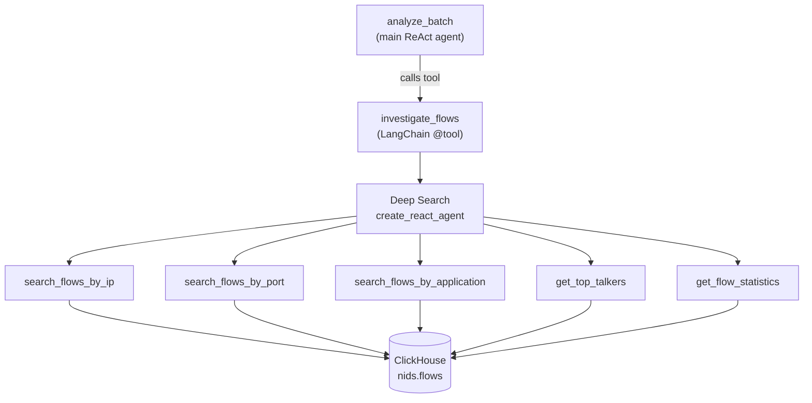

# Deep Search Agent

**File:** `agent/agents/deep_search_agent.py`

## Overview

The Deep Search Agent is a LangGraph `create_react_agent` equipped with five ClickHouse search tools. It is not invoked directly — it is wrapped as a single async `investigate_flows` LangChain tool and attached to the main `analyze_batch` agent in the LangGraph workflow.

When the main analysis agent determines it needs historical context — *"has this source IP appeared before?"*, *"are there unusual traffic patterns on port 4444?"* — it calls `investigate_flows` with a natural-language query. The sub-agent runs its own ReAct loop, queries ClickHouse, reasons over the results, and returns a structured summary back to the main agent.

## Architecture



## Creating the Tool

`make_deep_search_tool(llm, store)` builds the sub-agent once and returns the async tool:

```python
from agents.deep_search_agent import make_deep_search_tool

investigate = make_deep_search_tool(llm, clickhouse_store)
main_agent  = create_react_agent(llm, [investigate])
```

This happens inside `analyze_batch` on every batch when a ClickHouse store is available.

## `investigate_flows` Tool

```
Name:   investigate_flows
Input:  query (str) — natural-language investigation request
Output: str          — structured summary from the sub-agent
Async:  yes
```

Example queries the main LLM might generate:

```
"find all flows from 10.0.0.5 in the last hour"
"show the top bandwidth consumers over the last 30 minutes"
"are there any flows to port 4444 or 31337?"
"search for DNS traffic and flag unusually high query rates"
"how many half-open TCP connections exist right now?"
```

## Available Search Tools

| Tool | Signature | ClickHouse Query |
|------|-----------|-----------------|
| `search_flows_by_ip` | `(ip_address: str)` | `WHERE src_ip = ? OR dst_ip = ?` — latest 50 |
| `search_flows_by_port` | `(port: int)` | `WHERE src_port = ? OR dst_port = ?` — latest 50 |
| `search_flows_by_application` | `(application_name: str)` | `WHERE lower(application_name) LIKE ?` — latest 50 |
| `get_top_talkers` | `(minutes: int = 60)` | `GROUP BY src_ip ORDER BY sum(bytes) DESC` — top 10 |
| `get_flow_statistics` | `(src_ip: str = "", minutes: int = 60)` | Aggregates: count, bytes, avg PPS, RST flows, half-open |

All tools return JSON strings. Queries use parameterised placeholders — no SQL injection risk.

## Sub-Agent System Prompt

```
You are a network forensics analyst with access to a historical flow database.
Use the available tools to investigate the user's query thoroughly.
Always call at least one tool before answering.
Return a concise, structured summary of your findings.
```

## Graceful Degradation

If `clickhouse_store` is `None` (ClickHouse unavailable), `make_deep_search_tool` is never called and `analyze_batch` runs with an empty tools list. The LLM still analyses the current batch — it just cannot look up historical context.

```python
# In analyze_batch:
tools = [make_deep_search_tool(llm, store)] if store else []
agent = create_react_agent(llm, tools)
```

## Tool Implementation

Tools are closures over the `ClickHouseFlowStore` instance, created by `make_flow_search_tools(store)` in `agents/tools/flow_search_tools.py`:

```python
def make_flow_search_tools(store: ClickHouseFlowStore) -> List:
    @tool
    def search_flows_by_ip(ip_address: str) -> str:
        """Search the flow history for a specific IP address."""
        results = store.search_by_ip(ip_address)
        return json.dumps(results, default=str) if results else "No flows found."

    # ... four more tools
    return [search_flows_by_ip, search_flows_by_port, ...]
```
