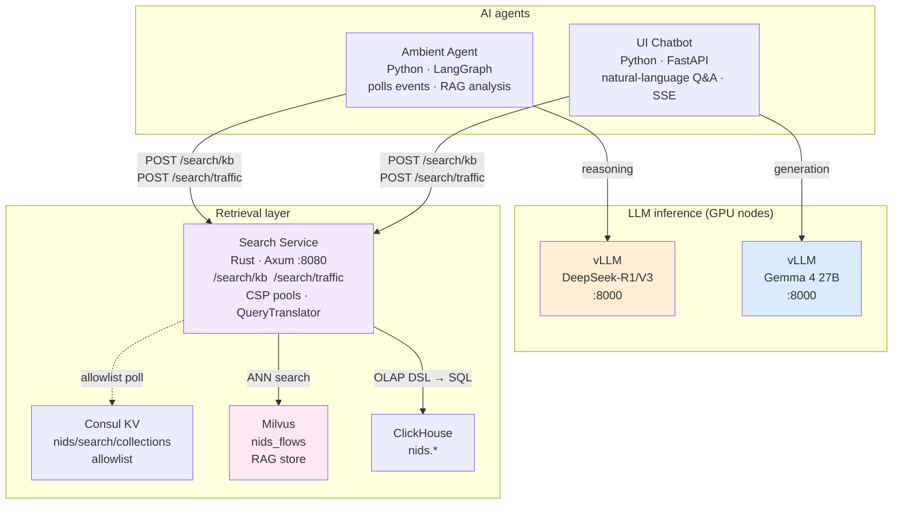
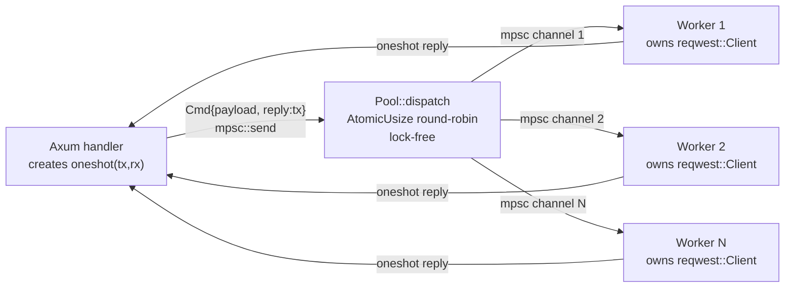

# Conversational AI Layer

The Conversational AI layer adds LLM-powered reasoning and natural-language
interaction on top of the classified flow data stored in ClickHouse. It
consists of two independent services backed by separate vLLM inference pods and
a shared Milvus vector store.

## Components



---

## Search Service (`services/search/`)

The Search Service is a Rust/Axum microservice that is the **single retrieval gateway** for all AI components. No client ever calls Milvus or ClickHouse directly.

### Internal design



Both backends (`ClickHouseBackend`, `MilvusBackend`) implement the `SearchBackend<Req,Resp>` trait. The `SearchRouter` type-erases them at registration, so handlers call `router.dispatch("kb"|"traffic", body)` without knowing backend types. The `QueryTranslator` trait isolates ClickHouse SQL dialect from the query DSL — swapping the database requires only a new translator implementation.

**Module structure:** `query.rs` (DSL + trait), `backend.rs` (router), `pool.rs` (CSP pool), `consul.rs` (allowlist watcher), `clickhouse.rs` (translator + pool), `milvus.rs` (pool), `main.rs` (routes).

### Endpoints

| Endpoint | Backend | Description |
|----------|---------|-------------|
| `POST /search/kb` | Milvus | ANN vector search on a named collection |
| `POST /search/traffic` | ClickHouse | OLAP DSL query (compiled to SQL, no raw SQL) |
| `GET /collections` | Consul | Live allowlist from `nids/search/collections` |
| `GET /health` | — | Liveness probe |

### Collection allowlist

Stored in Consul KV at `nids/search/collections` (JSON array). Polled every `NIDS_CONSUL_POLL_S` seconds; updated via lock-free `ArcSwap`. Requests with an unlisted `collection` are rejected with `403`. Falls back to `NIDS_MILVUS_COLLECTIONS` if Consul is unreachable at startup.

### OLAP DSL — `/search/traffic`

No raw SQL. Callers submit structured OLAP objects compiled to ClickHouse SQL internally.

| Field | Description |
|-------|-------------|
| `collection` | ClickHouse table (from Consul allowlist) |
| `dimensions` | Columns to SELECT and GROUP BY |
| `metrics` | Aggregations: `count` `count_distinct` `sum` `avg` `min` `max` |
| `filters` | WHERE: `eq` `ne` `gt` `gte` `lt` `lte` `in` `not_in` `like` `ilike` `is_null` `is_not_null` |
| `joins` | JOIN another OLAP cube: `inner` / `left` / `right` / `full` / `cross` |
| `union_all` | UNION ALL branches (ORDER BY + LIMIT applied to combined result) |
| `order_by` | Sorting |
| `limit` | Row cap |

The response field `compiled_query` shows the SQL sent to ClickHouse (useful for debugging).

### Example requests

```bash
# KB: top-5 similar DoS flow embeddings
curl -s -X POST http://nids-search:8080/search/kb \
  -H "Content-Type: application/json" \
  -d '{
    "collection": "nids_flows",
    "embedding": [0.1, -0.3, ...],
    "top_k": 5,
    "filter": "label == \"DoS\""
  }'

# Traffic: top attacking IPs (OLAP DSL)
curl -s -X POST http://nids-search:8080/search/traffic \
  -H "Content-Type: application/json" \
  -d '{
    "collection": "nids.security_events",
    "dimensions": ["src_ip"],
    "metrics":    [{"agg": "count", "field": "*", "alias": "hits"}],
    "filters":    [{"field": "detected_at", "op": "gte", "value": "2026-05-31T00:00:00Z"}],
    "order_by":   [{"field": "hits", "dir": "desc"}],
    "limit": 20
  }'

# ILIKE — all DNS-related flows
curl -s -X POST http://nids-search:8080/search/traffic \
  -H "Content-Type: application/json" \
  -d '{
    "collection": "nids.flows",
    "dimensions": ["src_ip", "application_name"],
    "filters":    [{"field": "application_name", "op": "ilike", "value": "%dns%"}],
    "limit": 200
  }'

# JOIN two cubes — correlate events with classified flows
curl -s -X POST http://nids-search:8080/search/traffic \
  -H "Content-Type: application/json" \
  -d '{
    "collection": "nids.security_events",
    "dimensions": ["src_ip"],
    "metrics":    [{"agg": "count", "field": "*", "alias": "hits"}],
    "joins": [{
      "collection": "nids.classified_flows",
      "alias": "cf",
      "kind": "inner",
      "on": [{"left": "flow_id", "right": "flow_id"}]
    }],
    "order_by": [{"field": "hits", "dir": "desc"}],
    "limit": 50
  }'

# UNION ALL — DoS and DDoS in one result set
curl -s -X POST http://nids-search:8080/search/traffic \
  -H "Content-Type: application/json" \
  -d '{
    "collection": "nids.security_events",
    "dimensions": ["src_ip"],
    "metrics":    [{"agg": "count", "field": "*", "alias": "hits"}],
    "filters":    [{"field": "label", "op": "eq", "value": "DoS"}],
    "union_all": [{
      "dimensions": ["src_ip"],
      "metrics":    [{"agg": "count", "field": "*", "alias": "hits"}],
      "filters":    [{"field": "label", "op": "eq", "value": "DDoS"}]
    }],
    "order_by": [{"field": "hits", "dir": "desc"}],
    "limit": 100
  }'
```
---

## Ambient Agent (`services/ai_agent/`)

The ambient agent is a **long-running Kubernetes Deployment** that continuously
monitors classified security events and produces structured threat summaries.

### LangGraph graph

```
fetch_new_events       ← POST /search/traffic (ClickHouse: new security_events)
      │
      ▼
embed_and_store        ← embed flow summary → POST /search/kb upsert into Milvus
      │
      ▼
rag_retrieve           ← POST /search/kb (top-k similar historical events)
      │
      ▼
llm_analyze            ← DeepSeek multi-step chain-of-thought reasoning
      │
      ▼
write_summary          ← INSERT INTO nids.ai_incidents (ClickHouse)
      │
      └──────────────→ loop back to fetch_new_events (when events remain)
```

### What it produces

For each batch of new `nids.security_events` rows it writes a row to
`nids.ai_incidents`:

| Field | Description |
|-------|-------------|
| `incident_id` | UUID |
| `detected_at` | Timestamp of the triggering event |
| `attack_type` | Normalised attack class (e.g. `DoS`, `BruteForce`) |
| `affected_hosts` | JSON array of targeted IPs |
| `confidence` | Aggregate confidence from classifier + LLM |
| `summary` | Human-readable threat summary |
| `recommended_action` | LLM-generated response recommendation |
| `rag_context_ids` | Milvus IDs of retrieved similar events |

### Configuration

```yaml
# services/ai_agent/config/config.yaml
clickhouse:
  url: "http://clickhouse:8123"
  database: "nids"

milvus:
  uri: "http://milvus:19530"
  collection: "nids_flows"

deepseek:
  base_url: "http://vllm-deepseek:8000/v1"
  model: "deepseek-ai/DeepSeek-R1-Distill-Llama-8B"

embed:
  model: "all-MiniLM-L6-v2"

agent:
  poll_interval_seconds: 30
  batch_size: 50
  rag_top_k: 5
```

All values are overridable via env vars (`NIDS_CH_URL`, `NIDS_MILVUS_URI`,
`NIDS_DEEPSEEK_URL`, `NIDS_DEEPSEEK_MODEL`, `NIDS_EMBED_MODEL`,
`NIDS_POLL_INTERVAL_S`).

---

## UI Chatbot (`services/chatbot/`)

A **FastAPI** application that accepts natural-language questions from security
analysts and answers them by combining:

1. Semantic search over Milvus (for context about similar past events).
2. Structured SQL queries against ClickHouse (for exact counts and time ranges).
3. **Gemma 4** inference via vLLM (for natural-language generation, streamed
   as Server-Sent Events).

### Request lifecycle

```
POST /chat  { "question": "..." }
   │
   ├─ embed question  →  POST /search/kb      →  top-k similar flow summaries
   ├─ structured query →  POST /search/traffic →  ClickHouse aggregations
   │                   (both via Search Service)
   └─ build prompt  →  vLLM (Gemma 4)  →  stream response chunks (SSE)
```

### Configuration

```yaml
# services/chatbot/config/config.yaml
milvus:
  uri: "http://milvus:19530"
  collection: "nids_flows"
  top_k: 8

clickhouse:
  url: "http://clickhouse:8123"
  database: "nids"

gemma:
  base_url: "http://vllm-gemma4:8000/v1"
  model: "google/gemma-4-27b-it"
  max_tokens: 512
  temperature: 0.2

embed:
  model: "all-MiniLM-L6-v2"
```

---

## vLLM Deployments

Both vLLM instances expose an **OpenAI-compatible REST API** on port 8000
(`/v1/chat/completions`, `/v1/models`).

| Deployment | Model | Purpose |
|------------|-------|---------|
| `vllm-deepseek` | `deepseek-ai/DeepSeek-R1-Distill-Llama-8B` | Ambient agent reasoning |
| `vllm-gemma4` | `google/gemma-4-27b-it` | Chatbot generation |

Both deployments:
- Require a GPU node (`nodeSelector: nids/gpu: "true"`)
- Use `--dtype float16` and `--tensor-parallel-size 1` by default
- Mount the model weights from a PVC or download on first start via HuggingFace Hub
- Expose a `/health` liveness probe

To use a quantised variant (reduce VRAM):

```bash
# Edit infra/k8s/vllm-deepseek-deployment.yaml
--model deepseek-ai/DeepSeek-R1-Distill-Qwen-1.5B
--dtype bfloat16
```

---

## Milvus

Milvus is deployed as a Kubernetes StatefulSet with **MinIO** as the object store
and **etcd** for metadata.

**Collection schema** (`nids_flows`)

| Field | Type | Description |
|-------|------|-------------|
| `id` | INT64, auto | Primary key |
| `flow_id` | VARCHAR(128) | Source flow identifier |
| `embedding` | FLOAT_VECTOR(384) | Sentence-transformer embedding |
| `label` | VARCHAR(32) | Attack class |
| `confidence` | FLOAT | Classifier confidence |
| `src_ip` | VARCHAR(45) | Source IP |
| `dst_ip` | VARCHAR(45) | Destination IP |
| `detected_at` | INT64 | Unix timestamp (ms) |

Index: HNSW (`M=16`, `ef_construction=256`) on the `embedding` field.

---

## Kubernetes manifests

```
infra/k8s/
  vllm-deepseek-deployment.yaml   # DeepSeek vLLM server
  vllm-gemma4-deployment.yaml     # Gemma 4 vLLM server
  milvus-statefulset.yaml         # Milvus + MinIO + etcd
  ai-agent-deployment.yaml        # Ambient LangGraph agent
  chatbot-deployment.yaml         # UI chatbot
```

Apply everything:

```bash
kubectl apply -k infra/k8s/
```

---

## Local development (without GPU)

For local testing without GPU, point the agent and chatbot at a remote LLM
API (e.g. OpenAI or Groq) by overriding `NIDS_DEEPSEEK_URL` /
`NIDS_GEMMA_URL` in the environment:

```bash
export NIDS_DEEPSEEK_URL=https://api.groq.com/openai/v1
export NIDS_DEEPSEEK_MODEL=deepseek-r1-distill-llama-70b
export NIDS_DEEPSEEK_API_KEY=<your-key>
```

Milvus can be started locally with:

```bash
docker run -p 19530:19530 milvusdb/milvus:latest standalone
```
