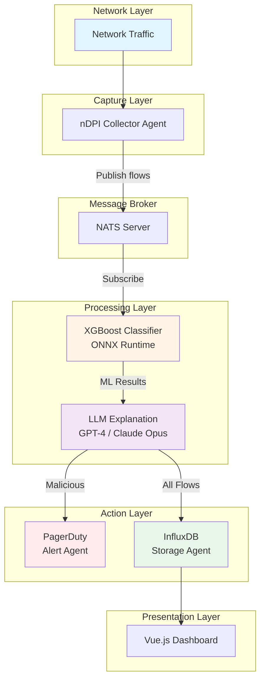
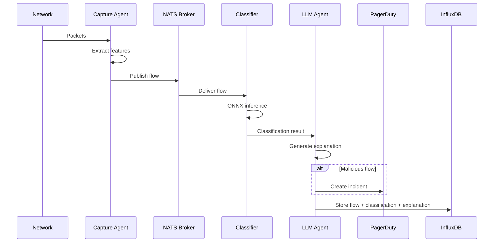
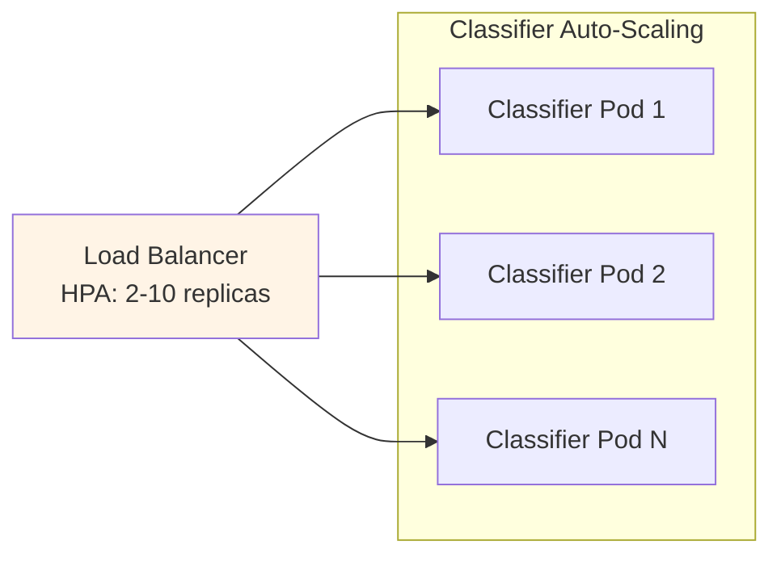
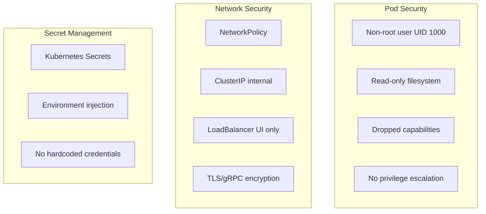

# Architecture Overview

## System Architecture

The Agentic NIDS implements a multi-agent architecture where specialized agents coordinate through message passing and state management.



## Agent Components

### Packet Capture Agent

**Technology**: nfstream + nDPI

**Responsibilities**:
- Capture packets from live interface or PCAP file
- Deep packet inspection (Layer 7 protocol detection)
- Flow aggregation (configurable 3-minute windows)
- Feature extraction (16 features)

**Output**: Network flows with statistical features

### XGBoost Classifier Agent

**Technology**: ONNX Runtime + A2A Protocol

**Responsibilities**:
- ML inference on network flows
- Binary classification (benign/malicious)
- Attack type detection
- Feature importance calculation
- Risk scoring (0-1 scale)

**Performance**: &lt;10ms per flow

###  LLM Explanation Agent

**Technology**: LangChain + OpenAI/Anthropic

**Supported Models**:
- OpenAI: GPT-4, GPT-4o, GPT-4o-mini
- Anthropic: Claude Opus 4.5, Claude Sonnet 4.5

**Responsibilities**:
- Generate human-readable explanations
- Priority classification (Critical/High/Medium/Low)
- Threat assessment
- Recommended actions
- Attack vector analysis

**Performance**: 1-3 seconds per explanation

###  PagerDuty Alert Agent

**Technology**: PagerDuty Events API v2

**Responsibilities**:
- Create incidents for malicious flows
- Severity mapping (confidence → severity)
- Deduplication
- Rich context inclusion

**Trigger**: Conditional (malicious flows only)

### InfluxDB Storage Agent

**Technology**: InfluxDB 2.7+ (Time-Series DB)

**Responsibilities**:
- Persist network flows
- Store ML classifications
- Save LLM explanations
- Tag-based indexing

**Measurements**:
- `network_flow`: Raw flow data
- `flow_classification`: ML results
- `llm_explanation`: AI explanations

## Data Flow



## State Management

The system uses an immutable state object (NIDSState) that flows through the workflow:

```typescript
interface NIDSState {
  // Configuration
  capture_source: string;
  collection_interval: number;
  nats_url: string;

  // Agent outputs
  flows: FlowData[];
  classifications: ClassificationResult[];
  explanations: LLMExplanation[];
  pagerduty_incidents: PagerDutyIncident[];

  // Metrics
  flows_captured: number;
  malicious_count: number;
  alerts_sent_count: number;

  // Status
  current_step: WorkflowStep;
  errors: string[];
}
```

## Communication Protocols

### Agent2Agent (A2A)

- **Transport**: gRPC with streaming
- **Port**: 50051 (default)
- **Use Case**: ML classifier requests
- **Features**: Task status tracking, bidirectional streaming

### NATS Messaging

- **Transport**: TCP
- **Port**: 4222 (default)
- **Use Case**: Asynchronous flow distribution
- **Features**: Pub/sub, JetStream persistence, load balancing

### InfluxDB Line Protocol

- **Transport**: HTTP
- **Port**: 8086 (default)
- **Use Case**: Time-series data storage
- **Features**: Tag-based indexing, retention policies

## Scalability



**Horizontal Scaling**:
- Classifier agents: 2-10 replicas (HPA)
- LLM agents: 2-5 replicas (HPA)
- UI: 2+ replicas

**Vertical Scaling**:
- Resource requests/limits configurable
- Node affinity for high-performance nodes

## Security



## Next Steps

- [Data Models](./data-models) - Understand data structures
- [Workflow](./workflow) - Execution flow details
- [Deployment](../deployment/kubernetes) - Production setup
