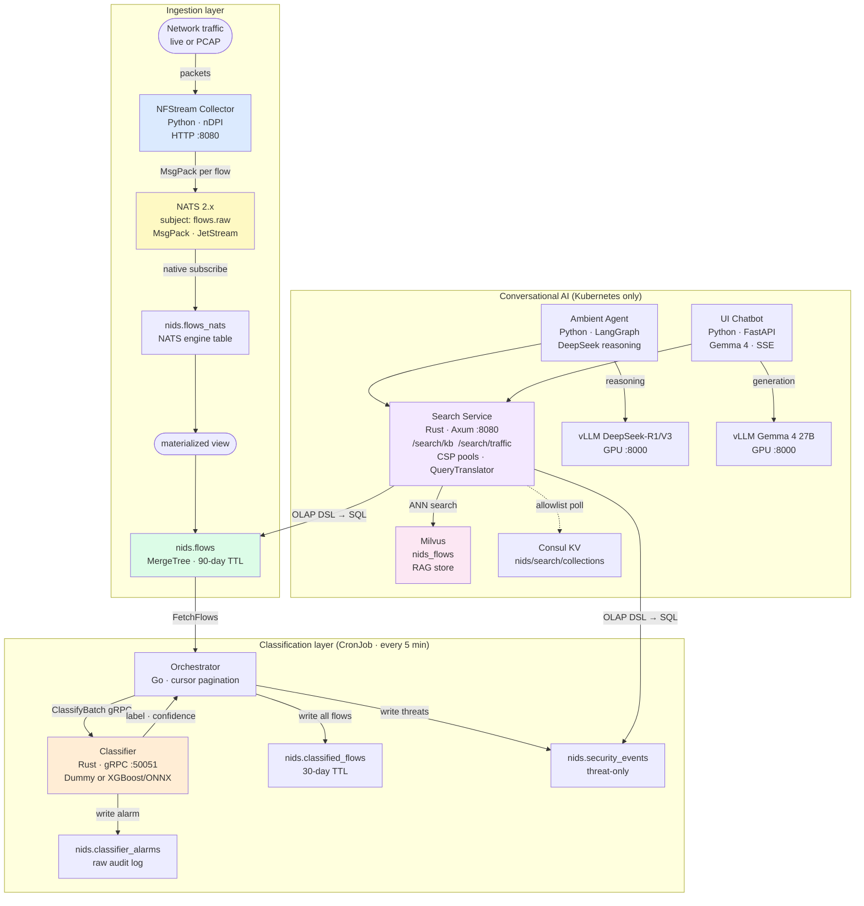

# Architecture Overview

## System diagram


```mermaid
flowchart TB
    subgraph Ingestion ["Ingestion layer"]
        NET([Network traffic\nlive or PCAP])
        COL["NFStream Collector\nPython · nDPI\nHTTP :8080"]
        NATS["NATS 2.x\nsubject: flows.raw\nMsgPack · JetStream"]
        NATS_TBL["nids.flows_nats\nNATS engine table"]
        MV(["materialized view"])
        FLOWS["nids.flows\nMergeTree · 90-day TTL"]

        NET -->|packets| COL
        COL -->|MsgPack per flow| NATS
        NATS -->|native subscribe| NATS_TBL
        NATS_TBL --> MV --> FLOWS
    end

    subgraph Classification ["Classification layer  (CronJob · every 5 min)"]
        ORCH["Orchestrator\nGo · cursor pagination"]
        CLF["Classifier\nRust · gRPC :50051\nDummy or XGBoost/ONNX"]
        CF["nids.classified_flows\n30-day TTL"]
        SE["nids.security_events\nthreat-only"]
        CA["nids.classifier_alarms\nraw audit log"]

        FLOWS -->|FetchFlows| ORCH
        ORCH -->|ClassifyBatch gRPC| CLF
        CLF -->|label · confidence| ORCH
        CLF -->|write alarm| CA
        ORCH -->|write all flows| CF
        ORCH -->|write threats| SE
    end

    subgraph ConvAI ["Conversational AI  (Kubernetes only)"]
        SEARCH["Search Service\nRust · Axum :8080\n/search/kb  /search/traffic\nCSP pools · QueryTranslator"]
        AGENT["Ambient Agent\nPython · LangGraph\nDeepSeek reasoning"]
        CHAT["UI Chatbot\nPython · FastAPI\nGemma 4 · SSE"]
        VDS["vLLM DeepSeek-R1/V3\nGPU :8000"]
        VG4["vLLM Gemma 4 27B\nGPU :8000"]
        MILVUS["Milvus\nnids_flows\nRAG store"]
        CONSUL["Consul KV\nnids/search/collections"]

        AGENT -->|reasoning| VDS
        CHAT -->|generation| VG4
        AGENT --> SEARCH
        CHAT --> SEARCH
        SEARCH -->|ANN search| MILVUS
        SEARCH -->|OLAP DSL → SQL| FLOWS
        SEARCH -->|OLAP DSL → SQL| SE
        SEARCH -.->|allowlist poll| CONSUL
    end

    style COL fill:#dbeafe
    style NATS fill:#fef9c3
    style FLOWS fill:#dcfce7
    style CLF fill:#ffedd5
    style SEARCH fill:#f3e8ff
    style MILVUS fill:#fce7f3
```

## NFStream collector

**Technology**: nfstream + nDPI  
**Runs as**: Unix daemon (double-fork, PID file, rotating log)

- Captures from a live interface **or** replays a PCAP file.
- nDPI provides Layer-7 protocol detection and statistical features.
- Each completed flow is serialised with **MsgPack** and published to NATS subject `flows.raw`.
- Configurable via `config/config.yaml`; all fields are overridable with CLI flags.

Key features extracted per flow: 22 numeric values including packet/byte counts, inter-arrival times, TCP flag counts, and derived rates.

## NATS

ClickHouse subscribes to NATS **natively** via its NATS table engine. There is no separate Python consumer. The schema defines:

```
nids.flows_nats  (ENGINE = NATS, nats_format = 'MsgPack')
       │
       └──[Materialized view]──► nids.flows  (MergeTree, 90-day TTL)
```

## Classifier gRPC service {#classifier}

**Technology**: Rust + tonic (gRPC) + OnnxRuntime (`ort` crate)  
**Source**: `services/classifier/`

Two interchangeable backends selected via `--classifier-type` (or `NIDS_CLASSIFIER_TYPE`):

- **`dummy`** (default) — deterministic pseudo-random labels; no model needed. Safe for development and integration testing.
- **`xgboost`** — ONNX model inference via OnnxRuntime. Requires `cargo build --features xgboost` and `--model path/to/model.onnx`.

The service exposes a single RPC: `ClassifyBatch([]FlowFeatures) → []ClassifyResponse`.

Returns for each flow:
  - `label` — the predicted attack class (e.g. `"DoS"`, `"BENIGN"`)
  - `confidence` — probability of the predicted class
  - `probabilities` — full per-class probability vector

The classifier also optionally writes a raw audit row to `nids.classifier_alarms` for every classified flow (enabled when `NIDS_CH_URL` is set).

### Attack classes

| Index | Label | Description |
|-------|-------|-------------|
| 0 | `BENIGN` | Normal traffic |
| 1 | `DoS` | Denial-of-Service |
| 2 | `DDoS` | Distributed DoS |
| 3 | `PortScan` | Port scanning |
| 4 | `BruteForce` | Credential guessing |
| 5 | `WebAttack` | SQL injection / XSS |
| 6 | `Botnet` | Bot-to-C2 traffic |
| 7 | `Malware` | Generic malware |

## Orchestrator (CronJob)

**Technology**: Go 1.22 + `github.com/ClickHouse/clickhouse-go/v2`  
**Source**: `services/orchestrator/`  
**Schedule**: every 5 minutes (`*/5 * * * *`), `concurrencyPolicy: Forbid`

1. Loads a persisted RFC3339Nano timestamp from a PVC-backed `/state` directory (defaults to `now − 24 h` on first run).
2. Paginates `nids.flows WHERE collected_at > cursor ORDER BY collected_at ASC LIMIT batch_size`.
3. Sends each page to `ClassifyBatch`.
4. Writes **all** classified flows (including BENIGN) to `nids.classified_flows`.
5. Writes non-BENIGN results to `nids.security_events` and logs each threat.
6. Advances the cursor to `max(collected_at)` of the page and saves state.

## Vault secret injection

All workloads (NATS, ClickHouse, collector, orchestrator, classifier) receive credentials via the **Vault Agent Injector**:

- Secrets live at `kv/data/nids/{clickhouse,nats,collector}` (KV-v2).
- Injected as files under `/vault/secrets/*.env` on each pod.
- TLS is self-managed via `AGENT_INJECT_TLS_AUTO`.

## Security model

- Collector pod runs with `NET_ADMIN` / `NET_RAW` capabilities and `hostNetwork: true` (required for packet capture).
- All other pods run unprivileged.
- No hardcoded credentials anywhere in manifests — all via Vault.

## Next steps

- [Workflow](./workflow) — step-by-step data flow
- [Data Models](./data-models) — ClickHouse schema details
- [Kubernetes Deployment](../deployment/kubernetes) — production setup
