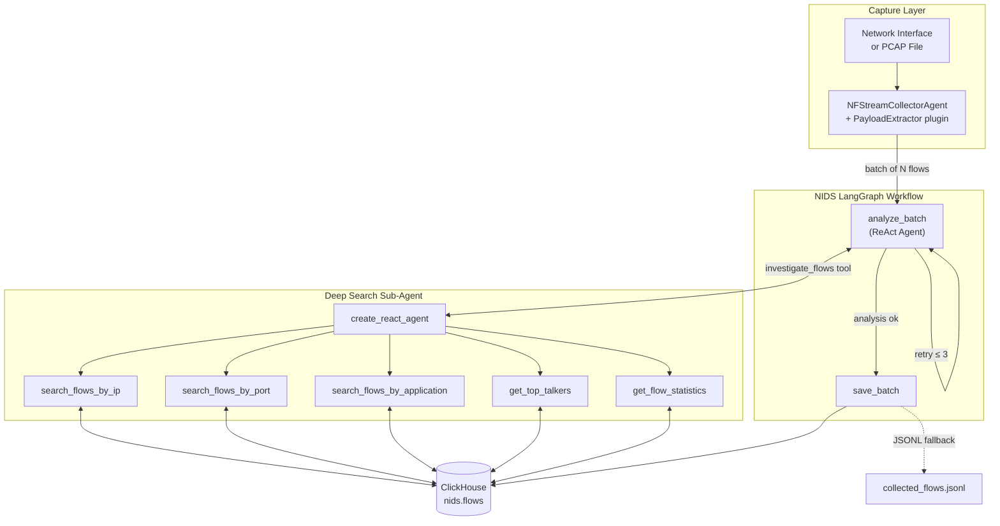
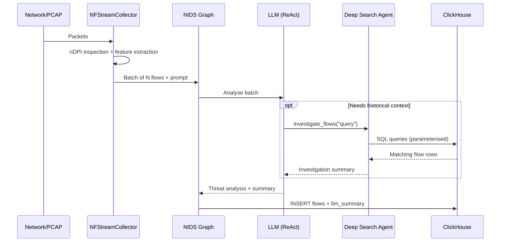

# Architecture Overview

## System Diagram


```mermaid
graph TB
    subgraph Capture["Capture Layer"]
        NET["Network Interface\nor PCAP File"]
        COL["NFStreamCollectorAgent\n+ PayloadExtractor plugin"]
        NET --> COL
    end

    subgraph Workflow["NIDS LangGraph Workflow"]
        direction LR
        ANA["analyze_batch\n(ReAct Agent)"]
        SAV["save_batch"]
        ANA -->|"analysis ok"| SAV
        ANA -->|"retry ≤ 3"| ANA
    end

    COL -->|"batch of N flows"| ANA

    subgraph DSA["Deep Search Sub-Agent"]
        direction TB
        REACT["create_react_agent"]
        T1["search_flows_by_ip"]
        T2["search_flows_by_port"]
        T3["search_flows_by_application"]
        T4["get_top_talkers"]
        T5["get_flow_statistics"]
        REACT --> T1 & T2 & T3 & T4 & T5
    end

    ANA <-->|"investigate_flows tool"| REACT
    T1 & T2 & T3 & T4 & T5 <--> CH

    SAV --> CH[("ClickHouse\nnids.flows")]
    SAV -.->|"JSONL fallback"| JSONL["collected_flows.jsonl"]
```

## Components

### NFStreamCollectorAgent

The entry point. Reads packets from a live interface or PCAP file using [nfstream](https://www.nfstream.org/), which embeds [nDPI](https://www.ntop.org/products/deep-packet-inspection/ndpi/) for Layer 7 application identification.

- Spawns an `NFStreamer` with the optional `PayloadExtractor` plugin
- Converts each `NFlow` to a JSON-serialisable dict (30+ features)
- Accumulates flows into batches and calls `nids_graph.ainvoke(...)` per batch
- Handles `SIGINT` for graceful shutdown

### NIDS LangGraph Workflow

A compiled `StateGraph` with two nodes and a conditional retry edge.

| Node | What it does |
|------|-------------|
| `analyze_batch` | Builds a `create_react_agent` with the `investigate_flows` tool (if ClickHouse is available). The LLM reads the batch prompt, optionally calls the tool to look up historical patterns, then returns its threat summary. |
| `save_batch` | Inserts the batch + LLM summary into ClickHouse. Falls back to JSONL if no store is configured. |

The `route_after_analysis` edge retries `analyze_batch` up to `_MAX_RETRIES = 3` times on LLM failure, then proceeds to `save_batch` regardless.

### Deep Search Sub-Agent

A second `create_react_agent` wrapped as a single async `investigate_flows` LangChain tool. When the main analysis agent needs historical context — *"has this IP appeared before?"*, *"who are the top talkers?"* — it calls `investigate_flows("natural language query")`. The sub-agent runs its own ReAct loop against ClickHouse and returns a structured summary.

### ClickHouseFlowStore

Manages the `nids.flows` table:

- Creates the database and table on startup (`_ensure_schema`)
- `insert_flows(flows, llm_summary)` — batch columnar insert
- Five read methods used by the search tools (parameterised, SQL-injection safe)

### LLMExplanationAgent

Initialises either `ChatAnthropic` or `ChatOpenAI`. Exposes two chains:

| Chain | Used by | Returns |
|-------|---------|---------|
| `chain` (structured Pydantic) | `explain_classification` | `LLMExplanationResult` |
| `_batch_chain` (plain text) | `analyze_flows` | `{"anomalies": [], "summary": str}` |

The raw `llm_agent.llm` handle is passed into the graph configurables so `create_react_agent` can build agents from it directly.

## Data Flow Sequence


```mermaid
sequenceDiagram
    participant Net as Network/PCAP
    participant Col as NFStreamCollector
    participant Graph as NIDS Graph
    participant LLM as LLM (ReAct)
    participant DSA as Deep Search Agent
    participant CH as ClickHouse

    Net->>Col: Packets
    Col->>Col: nDPI inspection + feature extraction
    Col->>Graph: Batch of N flows + prompt

    Graph->>LLM: Analyse batch

    opt Needs historical context
        LLM->>DSA: investigate_flows("query")
        DSA->>CH: SQL queries (parameterised)
        CH-->>DSA: Matching flow rows
        DSA-->>LLM: Investigation summary
    end

    LLM-->>Graph: Threat analysis + summary
    Graph->>CH: INSERT flows + llm_summary
```

## File Map

```
agent/
├── nfstream_collector_agent.py      # NFStreamCollectorAgent, CLI
└── agents/
    ├── nids_graph.py                # LangGraph workflow (StateGraph)
    ├── deep_search_agent.py         # make_deep_search_tool()
    ├── llm/
    │   └── llm_explanation_agent.py # LLMExplanationAgent
    ├── storage/
    │   └── clickhouse_store.py      # ClickHouseFlowStore
    └── tools/
        └── flow_search_tools.py     # 5 @tool functions
```
