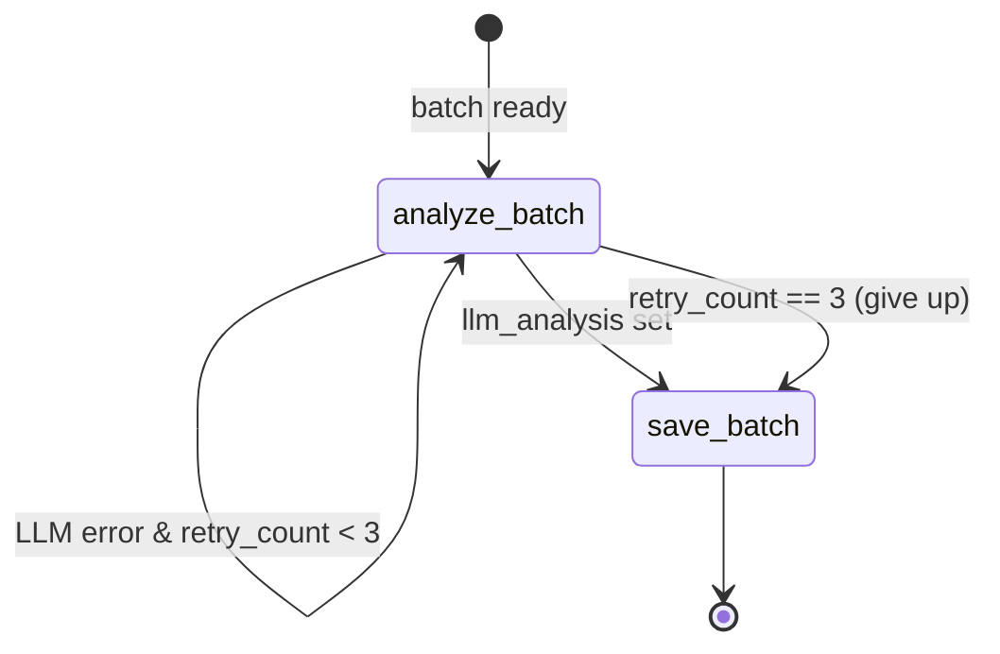

# LangGraph Workflow

## State Machine

The NIDS processing pipeline is a compiled `StateGraph`. Each batch of flows enters at `START` and exits at `END` after being analysed and stored.



## Batch State

```python
class NIDSBatchState(TypedDict):
    flows: List[Dict]                         # the batch of flow dicts
    prompt: str                               # assembled LLM prompt
    llm_analysis: Optional[Dict]              # {"anomalies": [], "summary": "..."}
    errors: Annotated[List[str], operator.add] # appended across nodes
    retry_count: int                          # incremented on LLM failure
```

`errors` uses `operator.add` as its LangGraph reducer — every node's error list is appended to the accumulated state rather than replaced.

## Node: `analyze_batch`

```python
async def analyze_batch(state, config):
    llm   = config["configurable"]["llm"]            # BaseChatModel
    store = config["configurable"]["clickhouse_store"] # may be None

    tools = [make_deep_search_tool(llm, store)] if store else []
    agent = create_react_agent(llm, tools)

    result = await agent.ainvoke({
        "messages": [{"role": "user", "content": state["prompt"]}]
    })
    summary = result["messages"][-1].content
    return {"llm_analysis": {"anomalies": [], "summary": summary}}
    # on exception → {"errors": [str(exc)], "retry_count": n + 1}
```

The agent is built fresh per batch. When ClickHouse is available, `investigate_flows` is attached and the LLM may call it zero or more times before producing its final answer.

## Node: `save_batch`

```python
async def save_batch(state, config):
    store       = config["configurable"]["clickhouse_store"]
    output_file = config["configurable"]["flows_output_file"]
    summary     = (state.get("llm_analysis") or {}).get("summary", "")

    if store:
        store.insert_flows(state["flows"], llm_summary=summary)   # ClickHouse
    elif output_file:
        # append newline-delimited JSON  →  JSONL fallback
```

## Routing

```python
_MAX_RETRIES = 3

def route_after_analysis(state) -> str:
    if state.get("llm_analysis") is not None:
        return "save"                          # success path
    if state["retry_count"] < _MAX_RETRIES:
        return "analyze"                       # retry
    return "save"                              # max retries — proceed without analysis
```

## Graph Construction

```python
builder = StateGraph(NIDSBatchState)
builder.add_node("analyze", analyze_batch)
builder.add_node("save",    save_batch)
builder.add_edge(START, "analyze")
builder.add_conditional_edges("analyze", route_after_analysis,
                               {"analyze": "analyze", "save": "save"})
builder.add_edge("save", END)
nids_graph = builder.compile()
```

## Invocation from the Collector

```python
result = await nids_graph.ainvoke(
    {
        "flows": batch,
        "prompt": prompt,
        "llm_analysis": None,
        "errors": [],
        "retry_count": 0,
    },
    config={
        "configurable": {
            "llm":               llm_agent.llm,          # raw LangChain model
            "clickhouse_store":  self.clickhouse_store,  # or None
            "flows_output_file": self.config.flows_output_file,
        }
    },
)
```

## Error Handling

| Failure | Behaviour |
|---------|-----------|
| LLM API error (first call) | `retry_count → 1`, retried |
| LLM API error (second call) | `retry_count → 2`, retried |
| LLM API error (third call) | `retry_count → 3`, falls through to `save_batch` with `llm_analysis = None` |
| ClickHouse insert error | Error appended to `state["errors"]`; batch cycle continues |
| JSONL write error | Error appended to `state["errors"]`; batch cycle continues |

After `ainvoke` returns, the collector logs any accumulated errors and the first 120 characters of the LLM summary.
