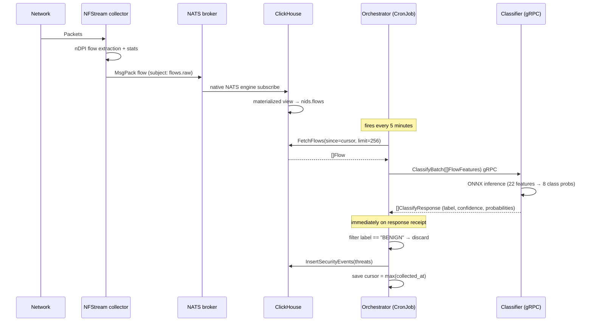

# System Workflow

## End-to-end detection pipeline



## Collector daemon lifecycle

```
nids-collector [--interface eth0 | --pcap file.pcap]
       │
       ├─ double-fork + setsid  (--daemon flag)
       ├─ write PID file         (--pid-file)
       ├─ rotate log file        (--log-file)
       │
       └─ NFStream streamer loop
              │
              ├─ on_flow_terminated(flow)
              │     └─ msgpack.packb(flow_to_dict(flow))
              │           └─ nats.publish("flows.raw", payload)
              │
              └─ on SIGTERM: drain + exit
```

## ClickHouse ingestion path

```
[NATS subject: flows.raw]
        │
        │  (ClickHouse native NATS engine — no Python consumer)
        ▼
 nids.flows_nats  (in-memory, ENGINE=NATS, format=MsgPack)
        │
        │  Materialized view  (automatic, streaming)
        ▼
 nids.flows       (MergeTree, PARTITION BY toYYYYMM(collected_at), TTL 90 days)
```

## Orchestrator pagination

The orchestrator maintains a persistent cursor so each CronJob run
processes only new flows:

```
state file: /state/last_processed_at  (RFC3339Nano)

Run N:
  cursor  = load_state()           # e.g. 2026-05-23T10:00:00Z
  page    = FetchFlows(> cursor)   # up to 256 flows, ASC
  results = ClassifyBatch(page)    # gRPC call
  events  = [r for r in results if r.label != "BENIGN"]
  InsertSecurityEvents(events)     # written to CH immediately
  cursor  = max(page.collected_at)
  save_state(cursor)
  repeat until len(page) < 256
```

## Security event record

Each stored event captures:

| Field | Type | Description |
|-------|------|-------------|
| `event_id` | UUID | Auto-generated |
| `detected_at` | DateTime | Insertion time |
| `flow_id` | String | Correlates back to `nids.flows` |
| `src_ip` / `dst_ip` | String | Endpoint addresses |
| `src_port` / `dst_port` | UInt16 | Endpoint ports |
| `protocol` | UInt8 | IP protocol number |
| `label` | LowCardinality(String) | Attack class (e.g. `DoS`) |
| `confidence` | Float32 | Probability of predicted class |
| `probabilities` | String | JSON — all 8 class probabilities |
| `bidirectional_packets` | UInt32 | Flow packet count |
| `bidirectional_bytes` | UInt64 | Flow byte count |
| `bidirectional_duration_ms` | UInt64 | Flow duration |

Example probabilities payload:
```json
{"BENIGN":0.02,"DoS":0.91,"DDoS":0.03,"PortScan":0.01,
 "BruteForce":0.01,"WebAttack":0.01,"Botnet":0.01,"Malware":0.00}
```
