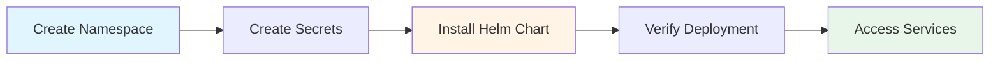
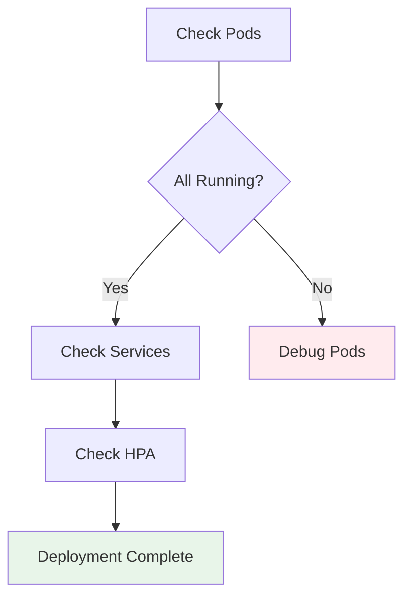

# Kubernetes Deployment

Deploy Agentic NIDS to production Kubernetes cluster with Helm.

## Prerequisites

- Kubernetes 1.28+
- Helm 3.12+
- kubectl configured
- Persistent storage class

## Deployment Flow



## Step 1: Create Namespace

```bash
kubectl create namespace nids
```

## Step 2: Create Secrets

### Environment Variables Template

Create `.env` file:

```bash
# LLM Provider (openai or anthropic)
export LLM_PROVIDER=anthropic
export LLM_MODEL=claude-opus-4-5

# API Keys
export OPENAI_API_KEY=sk-...
export ANTHROPIC_API_KEY=sk-ant-...

# PagerDuty (optional)
export PAGERDUTY_ROUTING_KEY=R0...

# InfluxDB
export INFLUXDB_URL=http://influxdb-service:8086
export INFLUXDB_ORG=nids
export INFLUXDB_BUCKET=network_security

# NATS
export NATS_URL=nats://nats-service:4222
```

Load environment:
```bash
source .env
```

### Create Kubernetes Secret

```bash
kubectl create secret generic agentic-nids-secrets \
  --from-literal=llmProvider=$LLM_PROVIDER \
  --from-literal=llmModel=$LLM_MODEL \
  --from-literal=openaiApiKey=$OPENAI_API_KEY \
  --from-literal=anthropicApiKey=$ANTHROPIC_API_KEY \
  --from-literal=pagerdutyRoutingKey=$PAGERDUTY_ROUTING_KEY \
  --from-literal=influxdbToken=$(openssl rand -base64 32) \
  --from-literal=influxdbPassword=$(openssl rand -base64 32) \
  -n nids
```

### Verify Secrets

```bash
kubectl get secrets -n nids
kubectl describe secret agentic-nids-secrets -n nids
```

## Step 3: Install Helm Chart

### Basic Installation

```bash
cd infra/helm

helm install agentic-nids ./agentic-nids \
  --namespace nids \
  --set llm.provider=$LLM_PROVIDER \
  --set llm.model=$LLM_MODEL
```

### Custom Values Installation

Create `custom-values.yaml`:

```yaml
# LLM Configuration
llm:
  enabled: true
  provider: anthropic  # or openai
  model: claude-opus-4-5
  replicas: 3
  temperature: 0.3
  autoscaling:
    enabled: true
    minReplicas: 2
    maxReplicas: 8

# Classifier Configuration
classifier:
  replicas: 3
  autoscaling:
    enabled: true
    minReplicas: 3
    maxReplicas: 15
    targetCPUUtilizationPercentage: 60

# InfluxDB Configuration
influxdb:
  enabled: true
  persistence:
    enabled: true
    size: 100Gi
    storageClass: fast-ssd
  config:
    retentionDays: 30

# PagerDuty Configuration
pagerduty:
  enabled: true

# Environment URLs (use env vars)
configMaps:
  natsUrl: "${NATS_URL:-nats://nats-service:4222}"
  influxdbUrl: "${INFLUXDB_URL:-http://influxdb-service:8086}"
```

Install with custom values:

```bash
helm install agentic-nids ./agentic-nids \
  -n nids \
  -f custom-values.yaml \
  --set configMaps.natsUrl=$NATS_URL \
  --set configMaps.influxdbUrl=$INFLUXDB_URL
```

## Step 4: Verify Deployment



### Check Pods

```bash
kubectl get pods -n nids
```

Expected output:
```
NAME                                    READY   STATUS    RESTARTS
agentic-nids-classifier-xxx-xxx         1/1     Running   0
agentic-nids-classifier-xxx-yyy         1/1     Running   0
agentic-nids-llm-xxx-xxx                1/1     Running   0
agentic-nids-influxdb-0                 1/1     Running   0
agentic-nids-nats-xxx-xxx               1/1     Running   0
agentic-nids-ui-xxx-xxx                 1/1     Running   0
```

### Check Services

```bash
kubectl get svc -n nids
```

### Check HPA

```bash
kubectl get hpa -n nids
```

### View Logs

```bash
# Classifier logs
kubectl logs -n nids deployment/agentic-nids-classifier --tail=50 -f

# LLM agent logs
kubectl logs -n nids deployment/agentic-nids-llm --tail=50 -f

# All logs
kubectl logs -n nids --all-containers=true --tail=50
```

## Step 5: Access Services

### Get UI URL

```bash
# Get LoadBalancer IP
export UI_IP=$(kubectl get svc agentic-nids-ui -n nids -o jsonpath='{.status.loadBalancer.ingress[0].ip}')

echo "Dashboard: http://$UI_IP"
```

### Port Forward (Development)

```bash
# Forward InfluxDB
kubectl port-forward -n nids svc/agentic-nids-influxdb-service 8086:8086

# Forward Classifier
kubectl port-forward -n nids svc/agentic-nids-classifier-service 50051:50051

# Forward UI
kubectl port-forward -n nids svc/agentic-nids-ui 3000:80
```

## Environment Variables Reference

All services use environment variables for configuration:

| Variable | Default | Description |
|----------|---------|-------------|
| `LLM_PROVIDER` | `openai` | LLM provider (openai/anthropic) |
| `LLM_MODEL` | `gpt-4o-mini` | Model name |
| `OPENAI_API_KEY` | - | OpenAI API key (required if provider=openai) |
| `ANTHROPIC_API_KEY` | - | Anthropic API key (required if provider=anthropic) |
| `PAGERDUTY_ROUTING_KEY` | - | PagerDuty routing key (optional) |
| `INFLUXDB_URL` | `http://localhost:8086` | InfluxDB server URL |
| `INFLUXDB_TOKEN` | - | InfluxDB auth token |
| `INFLUXDB_ORG` | `nids` | InfluxDB organization |
| `INFLUXDB_BUCKET` | `network_security` | InfluxDB bucket name |
| `NATS_URL` | `nats://localhost:4222` | NATS server URL |

## Configuration via ConfigMap

```yaml
apiVersion: v1
kind: ConfigMap
metadata:
  name: agentic-nids-config
  namespace: nids
data:
  # Service URLs (prefer environment variables)
  NATS_URL: "nats://nats-service:4222"
  INFLUXDB_URL: "http://influxdb-service:8086"
  INFLUXDB_ORG: "nids"
  INFLUXDB_BUCKET: "network_security"

  # Collection settings
  COLLECTION_INTERVAL: "180"
  BATCH_SIZE: "100"
  ALERT_THRESHOLD: "0.7"

  # LLM settings
  LLM_TEMPERATURE: "0.3"
  LLM_MAX_TOKENS: "1000"
```

Apply:
```bash
kubectl apply -f configmap.yaml
```

## Upgrade Deployment

```bash
# Upgrade with new values
helm upgrade agentic-nids ./agentic-nids \
  -n nids \
  -f custom-values.yaml

# Monitor rollout
kubectl rollout status deployment/agentic-nids-classifier -n nids
```

## Scaling

### Manual Scaling

```bash
# Scale classifier
kubectl scale deployment agentic-nids-classifier --replicas=5 -n nids

# Scale LLM agent
kubectl scale deployment agentic-nids-llm --replicas=3 -n nids
```

### Auto-Scaling (HPA)

HPA is enabled by default. Monitor:

```bash
kubectl get hpa -n nids -w
```

## Backup and Restore

### Backup InfluxDB

```bash
# Backup
kubectl exec -n nids influxdb-0 -- \
  influx backup /tmp/backup

# Download backup
kubectl cp nids/influxdb-0:/tmp/backup ./influxdb-backup
```

### Restore InfluxDB

```bash
# Upload backup
kubectl cp ./influxdb-backup nids/influxdb-0:/tmp/restore

# Restore
kubectl exec -n nids influxdb-0 -- \
  influx restore /tmp/restore
```

## Uninstall

```bash
# Delete Helm release
helm uninstall agentic-nids -n nids

# Delete namespace
kubectl delete namespace nids
```

## Troubleshooting

### Pods Not Starting

```bash
# Describe pod
kubectl describe pod <pod-name> -n nids

# Check events
kubectl get events -n nids --sort-by='.lastTimestamp'

# Check resource limits
kubectl top pods -n nids
```

### LLM Agent Failing

```bash
# Check logs
kubectl logs -n nids deployment/agentic-nids-llm

# Verify API key
kubectl get secret agentic-nids-secrets -n nids -o jsonpath='{.data.anthropicApiKey}' | base64 -d
```

### InfluxDB Connection Issues

```bash
# Test connection
kubectl run -it --rm debug --image=busybox --restart=Never -n nids -- sh
wget -O- http://influxdb-service:8086/health
```

## Next Steps

- [Monitoring](./monitoring) - Set up observability
- [Security](../guides/security) - Harden your deployment
- [Performance Tuning](../guides/performance) - Optimize performance
