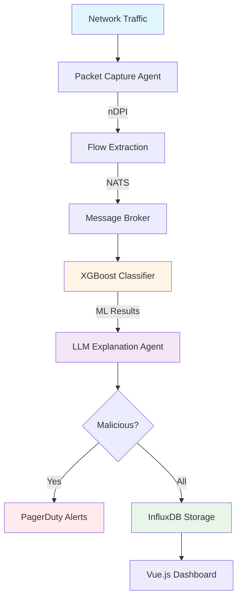

# Introduction to Agentic NIDS

**Agentic Network Intrusion Detection System** is an AI-powered network security platform that combines machine learning, explainable AI, and multi-agent architecture for real-time threat detection and automated incident response.

## Key Features

- 🤖 **Multi-Agent Architecture** - Distributed agents communicating via NATS and A2A protocol
- 🧠 **ML-Powered Detection** - XGBoost models in ONNX format for cross-platform inference
- 💡 **Explainable AI** - LLM-generated threat explanations (GPT-4, Claude Opus)
- 📊 **Real-Time Analytics** - InfluxDB time-series storage with Grafana integration
- 🚨 **Automated Alerts** - PagerDuty integration with priority-based incident creation
- ☸️ **Cloud-Native** - Kubernetes-ready with Helm charts and auto-scaling
- 🔍 **Deep Packet Inspection** - nDPI integration for Layer 7 protocol detection

## System Overview



## Quick Start

Get started in 5 minutes:

```bash
# Install dependencies
cd agent
pip install -e ".[all]"

# Set API keys
export OPENAI_API_KEY="sk-..."
# Or use Anthropic Claude
export ANTHROPIC_API_KEY="sk-ant-..."

# Run quick test
python main.py --mode test
```

## Architecture Highlights

### 1. Agent Layer
- **Packet Capture**: nfstream + nDPI for deep inspection
- **Classifier**: ONNX Runtime with XGBoost models
- **LLM Explainer**: OpenAI GPT-4 or Anthropic Claude Opus
- **Alert Manager**: PagerDuty Events API v2
- **Storage**: InfluxDB time-series database

### 2. Communication
- **NATS**: High-performance message broker (10M+ msg/sec)
- **Agent2Agent (A2A)**: gRPC streaming for ML inference
- **REST APIs**: InfluxDB, PagerDuty integration

### 3. Deployment
- **Docker**: Multi-stage builds for optimized images
- **Kubernetes**: Helm charts with HPA auto-scaling
- **Cloud-Ready**: AWS, GCP, Azure compatible

## Performance

| Metric | Specification |
|--------|---------------|
| Packet Capture | 10,000 flows/sec |
| ML Inference | &lt;10ms per flow |
| LLM Explanation | 1-3 seconds |
| End-to-End | &lt;5 seconds |

## Use Cases

1. **Enterprise SOC** - Real-time threat detection and response
2. **PCAP Analysis** - Offline traffic investigation
3. **Compliance** - Security audit trails
4. **Research** - ML model evaluation for network security
5. **Incident Response** - Automated triage and prioritization

## Next Steps

- [Architecture Overview](./architecture/overview) - Understand the system design
- [Quick Start Guide](./getting-started/quick-start) - Get up and running
- [Deployment Guide](./deployment/kubernetes) - Production deployment
- [API Reference](./api/agents) - Agent APIs and configuration
