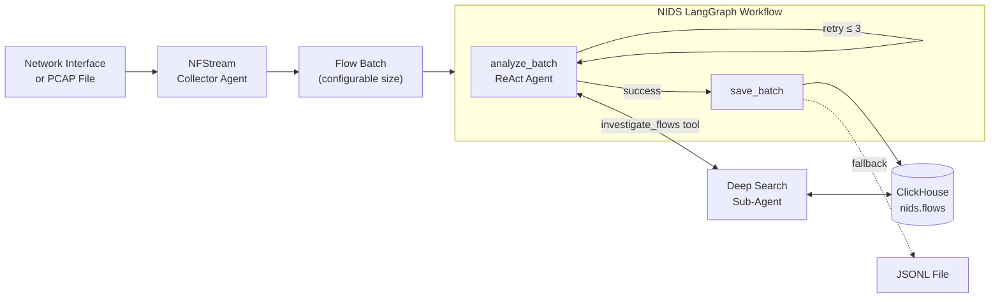

# Introduction to Agentic NIDS

**Agentic NIDS** is an AI-powered network intrusion detection system that combines deep packet inspection, a LangGraph-orchestrated agent workflow, and ClickHouse analytics to detect and explain network threats in real time.

## How It Works

```mermaid
graph LR
    NET["Network Interface\nor PCAP File"] --> COL["NFStream\nCollector Agent"]
    COL --> BATCH["Flow Batch\n(configurable size)"]

    subgraph GRAPH["NIDS LangGraph Workflow"]
        ANA["analyze_batch\nReAct Agent"] -->|success| SAV["save_batch"]
        ANA -->|"retry ≤ 3"| ANA
    end

    BATCH --> GRAPH

    ANA <-->|"investigate_flows tool"| DSA["Deep Search\nSub-Agent"]
    DSA <--> CH[("ClickHouse\nnids.flows")]
    SAV --> CH
    SAV -.->|fallback| JSONL["JSONL File"]
```

1. **NFStream Collector** captures packets from a live interface or PCAP file. nDPI identifies 300+ application protocols. Flows are accumulated into batches.
2. **LangGraph Workflow** processes each batch through two nodes — `analyze_batch` then `save_batch`.
3. **Analyze node** runs a ReAct LLM agent. The agent can call `investigate_flows` to query historical traffic in ClickHouse mid-analysis before producing its threat summary.
4. **Save node** writes flows and the LLM summary to ClickHouse (JSONL fallback if ClickHouse is unavailable).

## Key Features

- **nDPI Deep Packet Inspection** — Layer 7 protocol detection for 300+ applications
- **LangGraph State Machine** — explicit, retryable pipeline with up to 3 LLM retries
- **ReAct Analysis Agent** — LLM calls tools mid-analysis to investigate suspicious IPs, ports, and applications in ClickHouse
- **ClickHouse Storage** — columnar analytics with 30-day TTL, day-based partitioning, LowCardinality compression
- **Dual LLM Support** — Anthropic Claude or OpenAI GPT (key auto-detected from env)
- **PCAP and Live Capture** — works offline or on a live interface
- **Graceful Degradation** — JSONL fallback if ClickHouse is down; analysis-only mode if no LLM key is set

## Performance

| Metric | Value |
|--------|-------|
| Flow features extracted | 30+ per flow |
| Batch analysis latency | 2–8 s (LLM-bound) |
| LLM retries on failure | up to 3 |
| ClickHouse insert | batched, columnar |
| Flow history retention | 30 days (configurable TTL) |

## Next Steps

- [Quick Start](./getting-started/quick-start) — up and running in 5 minutes
- [Architecture Overview](./architecture/overview) — system design
- [LangGraph Workflow](./architecture/workflow) — state machine details
- [NFStream Collector](./agents/nfstream-collector) — flow collection and feature extraction
- [ClickHouse Storage](./storage/clickhouse) — schema, queries, and tuning
