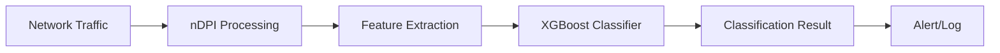

# XGBoost Classifier Integration with nDPI

This guide explains how to integrate XGBoost machine learning classifier with nDPI for enhanced network intrusion detection capabilities.

## Overview

XGBoost (Extreme Gradient Boosting) is a powerful machine learning algorithm that can significantly improve the accuracy of network intrusion detection when combined with nDPI's deep packet inspection capabilities.

## Dataset: NFUQNIDSv2

We recommend using the [NFUQNIDSv2 dataset](https://www.kaggle.com/datasets/aryashah2k/nfuqnidsv2-network-intrusion-detection-dataset) for training your XGBoost classifier.

### Dataset Characteristics

- **Total Records**: 11,994,893 network flows
- **Benign Flows**: 9,208,048 (76.77%)
- **Attack Flows**: 2,786,845 (23.23%)
- **Features**: 43 extended NetFlow features
- **License**: CC0 Public Domain

### Attack Categories

The dataset includes labeled data for multiple attack types:

- **DoS (Denial of Service)**
- **DDoS (Distributed Denial of Service)**
- **Brute Force attacks**
- **Injection attacks**

## Integration Architecture



## Feature Mapping

### nDPI to XGBoost Feature Pipeline

1. **Flow Identification**
   - Source/Destination IP addresses
   - Source/Destination ports
   - Protocol identification
   - Flow duration

2. **Statistical Features**
   - Packet count (forward/backward)
   - Byte count (forward/backward)
   - Flow inter-arrival times
   - Packet size statistics

3. **nDPI-Specific Features**
   - Protocol detection confidence
   - Application layer protocol
   - Detected risks/anomalies
   - TLS/SSL fingerprints (if applicable)

### Code Example: Feature Extraction

```cpp
// Example: Extracting features from nDPI flow for XGBoost
struct FlowFeatures {
    uint32_t src_ip;
    uint32_t dst_ip;
    uint16_t src_port;
    uint16_t dst_port;
    uint8_t protocol;
    uint32_t packets_forward;
    uint32_t packets_backward;
    uint64_t bytes_forward;
    uint64_t bytes_backward;
    uint32_t flow_duration;
    uint16_t detected_protocol;
    uint8_t risk_score;
    // Additional nDPI-specific features
};

void extract_features_from_ndpi_flow(struct ndpi_flow_info *flow,
                                     struct FlowFeatures *features) {
    features->src_ip = flow->src_ip;
    features->dst_ip = flow->dst_ip;
    features->src_port = flow->src_port;
    features->dst_port = flow->dst_port;
    features->protocol = flow->protocol;
    features->packets_forward = flow->packets[0];
    features->packets_backward = flow->packets[1];
    features->bytes_forward = flow->bytes[0];
    features->bytes_backward = flow->bytes[1];
    features->flow_duration = flow->last_seen - flow->first_seen;
    features->detected_protocol = flow->detected_protocol;
    features->risk_score = ndpi_risk_score(flow);
}
```

## Training Process

### 1. Data Preparation

```python
import pandas as pd
import xgboost as xgb
from sklearn.model_selection import train_test_split
from sklearn.preprocessing import LabelEncoder

# Load NFUQNIDSv2 dataset
df = pd.read_csv('nfuqnidsv2_dataset.csv')

# Prepare features and labels
features = df.drop(['Label'], axis=1)
labels = df['Label']

# Encode categorical labels
le = LabelEncoder()
labels_encoded = le.fit_transform(labels)

# Split dataset
X_train, X_test, y_train, y_test = train_test_split(
    features, labels_encoded, test_size=0.2, random_state=42
)
```

### 2. Model Training

```python
# Configure XGBoost parameters
params = {
    'objective': 'multi:softprob',
    'num_class': len(le.classes_),
    'max_depth': 6,
    'learning_rate': 0.1,
    'subsample': 0.8,
    'colsample_bytree': 0.8,
    'random_state': 42
}

# Train the model
dtrain = xgb.DMatrix(X_train, label=y_train)
dtest = xgb.DMatrix(X_test, label=y_test)

model = xgb.train(
    params=params,
    dtrain=dtrain,
    num_boost_round=100,
    evals=[(dtrain, 'train'), (dtest, 'test')],
    early_stopping_rounds=10,
    verbose_eval=True
)

# Save the trained model
model.save_model('nids_xgboost_model.json')
```

### 3. Model Integration

```cpp
// C++ integration example using XGBoost C API
#include <xgboost/c_api.h>

class XGBoostClassifier {
private:
    BoosterHandle booster;

public:
    bool load_model(const char* model_path) {
        return XGBoosterCreate(NULL, 0, &booster) == 0 &&
               XGBoosterLoadModel(booster, model_path) == 0;
    }

    int classify_flow(const struct FlowFeatures& features) {
        float input[FEATURE_COUNT];
        // Convert features to float array
        convert_features_to_array(features, input);

        DMatrixHandle dmat;
        XGDMatrixCreateFromMat(input, 1, FEATURE_COUNT, -1, &dmat);

        bst_ulong out_len;
        const float* result;
        XGBoosterPredict(booster, dmat, 0, 0, &out_len, &result);

        // Return class with highest probability
        int predicted_class = 0;
        float max_prob = result[0];
        for (int i = 1; i < out_len; i++) {
            if (result[i] > max_prob) {
                max_prob = result[i];
                predicted_class = i;
            }
        }

        XGDMatrixFree(dmat);
        return predicted_class;
    }
};
```

## Performance Optimization

### 1. Feature Selection

Use XGBoost's built-in feature importance to identify the most relevant features:

```python
# Get feature importance
importance = model.get_score(importance_type='weight')
sorted_features = sorted(importance.items(), key=lambda x: x[1], reverse=True)

# Select top features for production
top_features = [feature for feature, _ in sorted_features[:20]]
```

### 2. Real-time Classification

```cpp
// Implement efficient real-time classification
class RealTimeClassifier {
private:
    XGBoostClassifier classifier;
    std::queue<struct FlowFeatures> feature_queue;
    std::mutex queue_mutex;

public:
    void process_flow(struct ndpi_flow_info* flow) {
        struct FlowFeatures features;
        extract_features_from_ndpi_flow(flow, &features);

        int classification = classifier.classify_flow(features);

        if (classification != BENIGN_CLASS) {
            handle_malicious_flow(flow, classification);
        }
    }

private:
    void handle_malicious_flow(struct ndpi_flow_info* flow, int attack_type) {
        // Log alert, block traffic, etc.
        log_security_alert(flow, attack_type);
    }
};
```

## Model Evaluation Metrics

Monitor these metrics to ensure model performance:

- **Accuracy**: Overall classification correctness
- **Precision**: True positives / (True positives + False positives)
- **Recall**: True positives / (True positives + False negatives)
- **F1-Score**: Harmonic mean of precision and recall
- **False Positive Rate**: Critical for production environments

## Best Practices

1. **Regular Retraining**: Update the model with new attack patterns
2. **Feature Engineering**: Continuously improve feature extraction from nDPI
3. **Threshold Tuning**: Adjust classification thresholds based on security requirements
4. **Performance Monitoring**: Track classification latency and accuracy in production
5. **Ensemble Methods**: Consider combining multiple models for better accuracy

## Next Steps

- See [NetFlow Export](./netflow-export.md) for converting nDPI flows to standard NetFlow format
- Check [Examples](./examples.md) for complete implementation examples
- Review [API Reference](./api-reference.md) for detailed function documentation